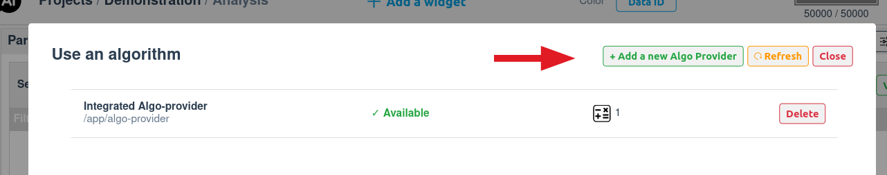
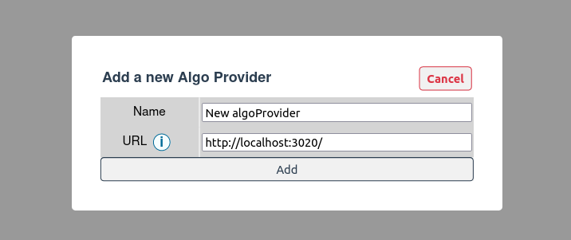

# Adding Algo-providers to DebiAI

Once you have created and deployed your Algo-provider, you can add it to DebiAI. We offer multiple ways to do so:

<LinkableChoices :choices="[
    {
        title: 'With debiai-gui',
        description: 'If using the cli provided by our python module',
        imageLink: '/install/terminal.svg',
        elementIdDestination: 'with-debiai-gui'
    },
    {
        title: 'From the dashboard',
        description: 'Easiest method, but not persistent',
        imageLink: '/install/screen.svg',
        elementIdDestination: 'from-the-dashboard'
    },
    {
        title: 'Env. variables',
        description: 'Best for Docker deployments',
        imageLink: '/install/world.svg',
        elementIdDestination: 'connecting-via-environment-variables'
    },
    {
        title: 'Configuration file',
        description: 'For development setups',
        imageLink: '/install/build.svg',
        elementIdDestination: 'connecting-via-configuration-file'
    }
  ]"
/>

## With DebiAI-gui

If you are using the [DebiAI-gui Python package](../../introduction/gettingStarted/installation/README.md#debiai-gui-python-package) to run DebiAI, you can add Algo-providers directly as parameters:

```bash
debiai-gui start -ap http://localhost:4000 http://localhost:8000
```

Once you have created and deployed your Algo-provider, you can add it to DebiAI.

## From the dashboard

You can add your Algo-provider directly from the dashboard. To do so, go to the Algo-providers page from the menu:


And click on the "Add a new Algo-provider" button:



You will need to provide the URL of your Algo-provider. This URL should be the root URL of your Algo-provider, for example: `https://my-algo-provider.com/`.



Once you have added your Algo-provider, you will be able to use the algorithms it provides in the Algorithms tab of the analysis dashboard:


## Connecting via Environment Variables

For deployments, you can define environment variables to specify provider URLs.

### Example:

```bash
export DEBIAI_ALGO_PROVIDER_MyAlgoProvider1=http://localhost:3000/
export DEBIAI_ALGO_PROVIDER_MyAlgoProvider2=http://localhost:3010/
```

With Docker:

```bash
docker run -p 3000:3000 \
    -e DEBIAI_ALGO_PROVIDER_MyAlgoProvider1=http://localhost:3000/ \
    -e DEBIAI_ALGO_PROVIDER_MyAlgoProvider2=http://localhost:3010/ \
    debiai/app
```

With Docker Compose:

```yaml
version: "3.8"
services:
  debiai:
    image: "debiai/app"
    ports:
      - "3000:3000"
    environment:
      - DEBIAI_ALGO_PROVIDER_MyAlgoProvider1=http://localhost:3000/
      - DEBIAI_ALGO_PROVIDER_MyAlgoProvider2=http://localhost:3010/
```

For a full list fo environment variables, check the [config.env](https://github.com/debiai/DebiAI/blob/main/debiaiServer/config/config.env) file.

## Connecting via Configuration File

You can also configure providers in config.ini:
Example `(debiai/debiaiServer/config/config.ini)`:

```ini
[ALGO_PROVIDERS]
MyAlgoProvider1 = http://localhost:3000/
MyAlgoProvider2 = http://localhost:3010/
```

After editing, restart DebiAI (or rebuild the Docker image if using containers).

::: tip Configuration priority order:

1. DebiAI-gui python module parameters
2. Environment variables
3. Configuration file settings.
   :::

If the Algo-provider is accessible and follows the API, DebiAI will list the algorithms in the dashboard analysis page.

::: warning  
**DebiAI must be able to access your Algo-provider.**

- If running locally, use `localhost` as the URL.
- If hosted externally, use the **public IP address**.
- When using **Docker**, you may need to use the public IP or `--network host` to access a provider deployed on `localhost`.  
   More details: [Docker documentation](https://docs.docker.com/network/host/).  
  :::
