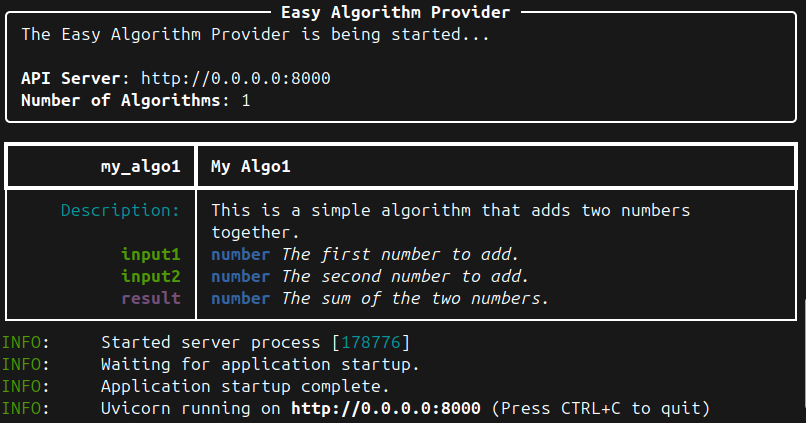

# Algo-provider python module

The [Algo-provider Python module](https://github.com/debiai/easy-algo-provider) starts a Fast API server that provides a REST API to interact with DebiAI. This is the easiest way to create an Algo-provider for DebiAI.

## Getting started

Install the module with pip:

```bash
pip install algo-provider
```

Then, create a Python file with the following content:

```python
# First define your algorithm following a strict docstring format
def my_algo1(input1: int, input2: int) -> int:
    """
    This is a simple algorithm that adds two numbers together.

    Parameters:
        input1 (int): The first number to add.
        input2 (int): The second number to add.

    Returns:
        int: The sum of the two numbers.
    """
    return input1 + input2

# Then create an AlgoProvider object and add your algorithm to it
from algo_provider import AlgoProvider
provider = AlgoProvider()
provider.add_algo(my_algo1)

# Finally, start the server
provider.start_server()
```

Run the Python file and your algorithm is now available through the Algo-provider API!



The content of the docstring will be used to generate Algo descriptions in the DebiAI interface, and the function will be called with the parameters provided by the user. The return value will be sent back to the user and displayed in the DebiAI interface.

## Parameters

You can specify the following parameters when adding an algorithm:

```python
provider.add_algo(
    my_algo_3,
    author="DebiAI",
    version="1.0.0",
    creation_date="2024-01-01",
    update_date="2024-01-01",
    tags=["Math", "Addition"],
)
```

[Algo-provider Python module GitHub page](https://github.com/debiai/easy-algo-provider)

After creating your Algo-provider, you can add it to DebiAI by providing the URL of your provider. [Learn more on how to add Algo-providers to DebiAI.](./addingAlgoProviders.md#adding-algo-providers-to-debiai)
