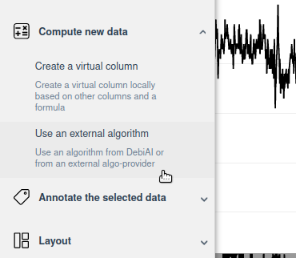
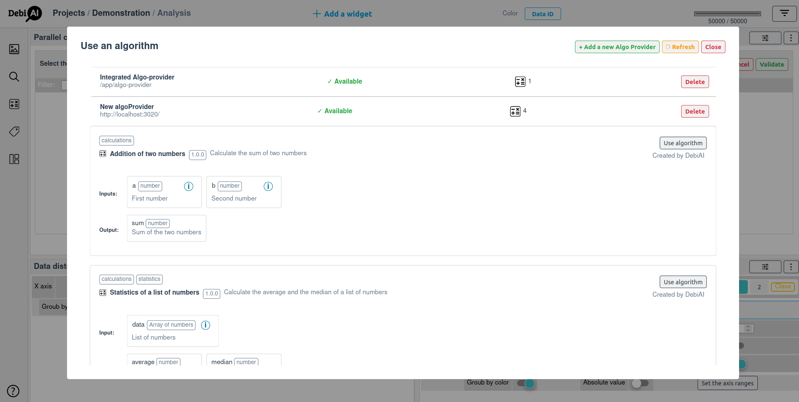
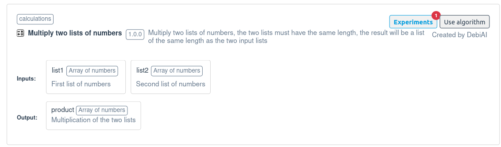
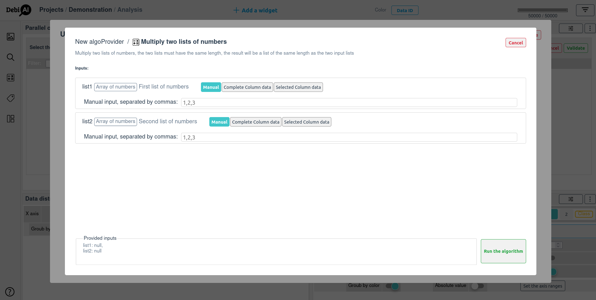
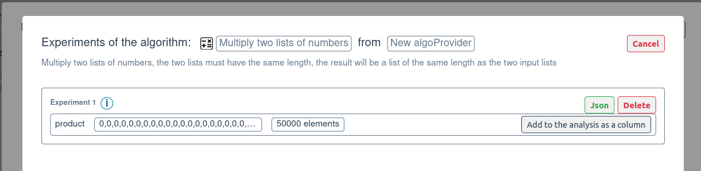

# How to use an algorithm from the dashboard

DebiAI allows you to use algorithms (integrated or custom) directly from the dashboard. This is useful if you want to analyze your data with a specific algorithm.

Go to the Algo-providers page from the menu:

You will see the list of available algorithms:

Click on the algorithm you want to use. You will see the description of the algorithm and the inputs it needs:

Fill the inputs and click on the "Run" button:

The algorithm will be run and the results will be available in the "Experiments" tab:

In the "Experiments" tab, you can see the results of the algorithm and you can add them to the analysis dashboard data as a new column:

Once the results are added to the analysis dashboard, you can analyze them like any other data.

Learn more about:
- [The different integrated algorithms in DebiAI](./integratedAlgorithms.md).
- [How to add your own algorithms to DebiAI](./algoProviders/).
- [How to analyze data in DebiAI](../dashboard/)

