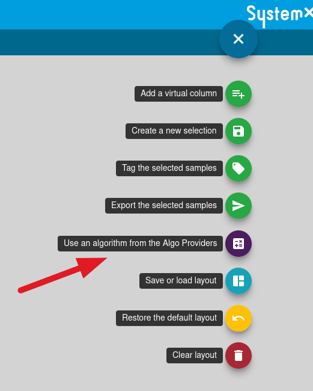
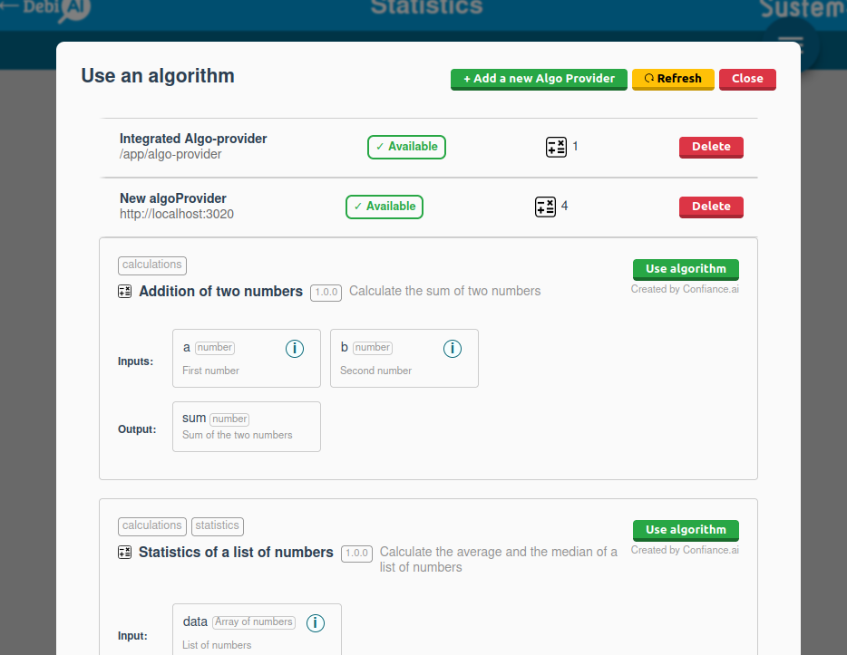
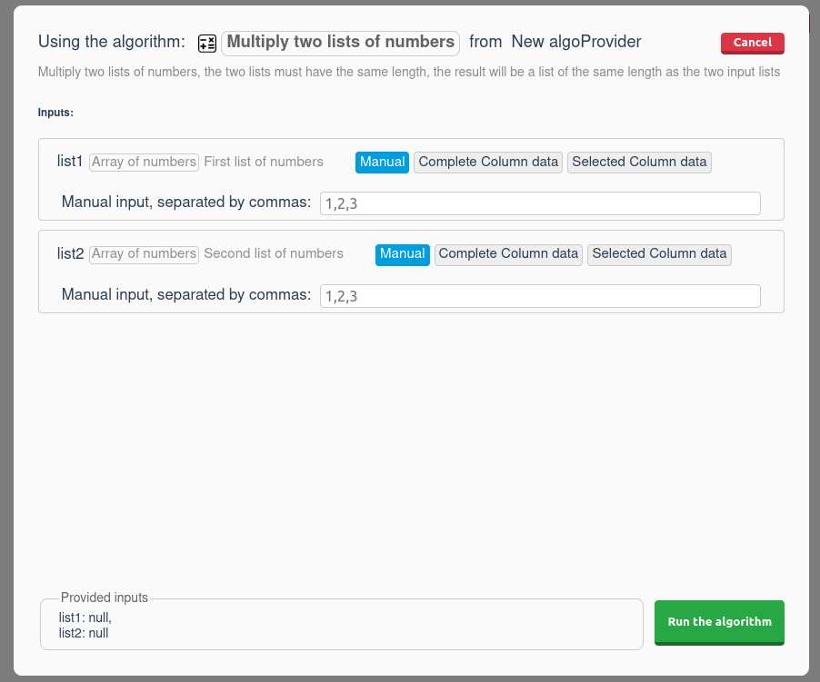
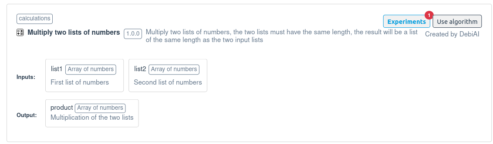
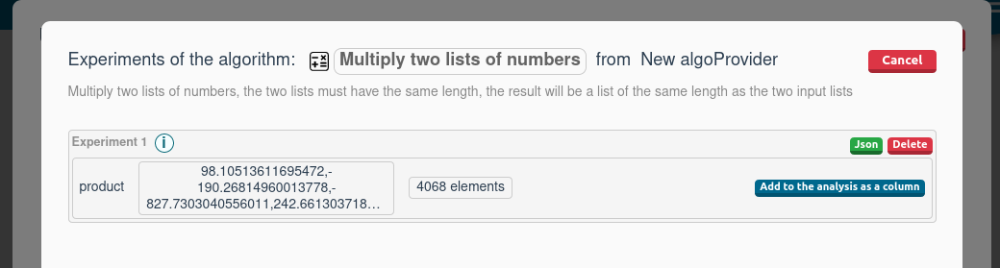

# Algo-providers, adding custom algorithms to DebiAI

From the DebiAI analysis dashboard and with the analyzed data, you can use some algorithms that can generate metrics. Those generated results can be added as a new column into the analysis dashboard data and be used with the widgets like any other column.

## How to use one algorithm

Go to the Algo-providers page from the menu:

<p align="center">

</p>

You will see the list of available algorithms:



Click on the algorithm you want to use. You will see the description of the algorithm and the inputs it needs:



Fill the inputs and click on the "Run" button:



The algorithm will be run and the results will be available in the "Experiments" tab:

In the "Experiments" tab, you can see the results of the algorithm and you can add them to the analysis dashboard data as a new column:



## Integrated algorithms

DebiAI comes with a set of algorithms that can be used with the data in the dashboard. You can find the list of available algorithms in the [Integrated algorithms documentation](./integratedAlgorithms.md).

## Custom algorithms

DebiAI allows you to implement your own algorithms. This can be useful if you want to use one that is not available in DebiAI or that is specific to your use case.

### Algorithms description

You will need to describe your algorithm in a Json format and then create the implementation of your algorithm. After that, DebiAI will be able to understand your algorithm and run it.

Here is, for example, the description of a simple moving average algorithm:

```json
{
  "id": "moving_average",
  "name": "Moving average",
  "description": "Calculate the moving average of a data.",
  "tags": ["calculations"],
  "author": "DebiAI",
  "version": "1.0.0",
  "inputs": [
    {
      "name": "data",
      "description": "The data to calculate the moving average on.",
      "type": "array",
      "arrayType": "number",
      "lengthMin": 1,
      "lengthMax": 100000
    },
    {
      "name": "periods",
      "description": "The number of periods to calculate the moving average on.",
      "type": "number",
      "default": 3,
      "min": 1,
      "max": 100
    }
  ],
  "outputs": [
    {
      "name": "moving_average",
      "description": "The moving average of the data. Same length as the data",
      "type": "array",
      "arrayType": "number"
    }
  ]
}
```

As you can see, the input and output of the algorithm are described. This description is used by DebiAI to understand how to run the algorithm and how to display it in the dashboard and what kind of data it needs.

To learn more about the algorithms descriptions, you can read the [Algorithm description documentation](https://github.com/debiai/algo-provider-python-template/blob/main/algo-api/README.md).

### Add your own algorithm

You can add your own algorithms to DebiAI in two ways:

- [Algo-provider Python module](https://github.com/debiai/easy-algo-provider). This is the easiest way to add your own algorithms to DebiAI. You just have to define a Python function that implements your algorithm and the library will take care of the rest.

- [Creating an Algo-provider service](./algoProviders.md). An algo-provider is a simple Web service that provides one or more algorithms. You can create your own algo-provider with any programming language, host it and provide the URL to DebiAI.

- [Inserting Python code in DebiAI](./implementInBackend.md). You can insert Python code directly in the DebiAI backend. This is useful if you want to use an algorithm that you have created in Python, but you don't want to host it yourself.

We are currently working on a way to add algorithms directly from the dashboard, [let us know](https://github.com/debiai/debiai/issues) if you are interested in this or any other feature.
