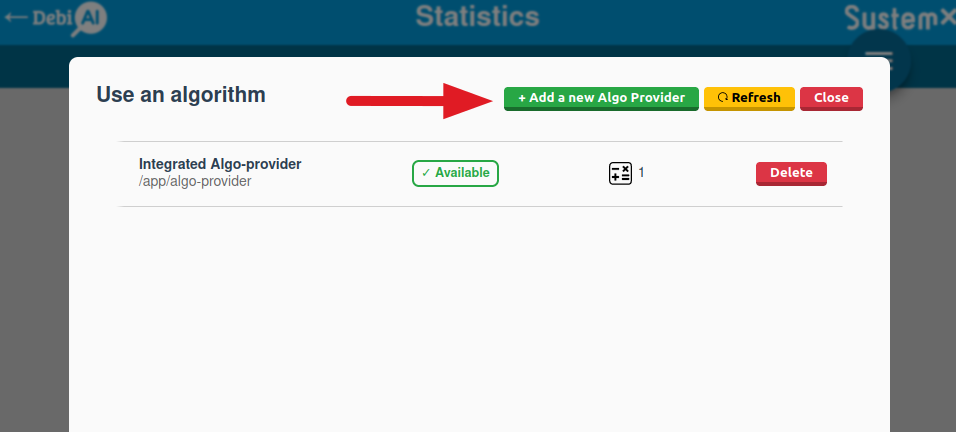
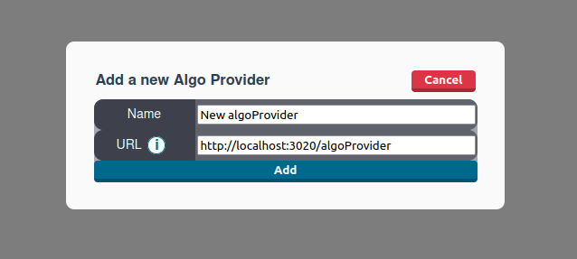

# Creating an Algo-provider

An algo provider is a service that you have to create that can respond to the algorithms requests of DebiAI. This service can be made in **any language**, can use **any kind algorithms** and can be hosted on **any platform** as long at the DebiAI algo-provider's API is respected.

DebiAI will interact with your algo provider in two ways:

- For getting the list of available algorithms
- For running an algorithm and getting the results

## The API

The Algo-providers API as been described with OpenAPI 3.0.

- [Algo-providers API Swagger documentation](https://petstore.swagger.io/?url=https://raw.githubusercontent.com/debiai/algo-provider-python-template/main/algo-api/OpenAPI/Algo_OpenAPI_V0.yaml)
- [Alg-providers API yaml file](https://github.com/debiai/algo-provider-python-template/blob/main/algo-api/OpenAPI/Algo_OpenAPI_V0.yaml).

## Getting started

To help you create your first algo provider, we have created an [Algo-provider Python template](https://github.com/debiai/algo-provider-python-template). You can use it as a starting point for your own algo provider.

If you want to create an algo provider in another language, you just need to respect the [Algo-providers API](#the-api).

You need help creating your algo provider? [Create an issue](https://github.com/debiai/debiai/issues) and we will help you.

## Adding your algo provider to DebiAI

Once you have created and deployed your algo provider, you can add it to DebiAI.

To do so, go to the [Algo providers page](https://app.debiai.tech/dashboard/algoProviders):

And click on the "Add a new algo provider" button:

You will need to provide the URL of your algo provider. This URL should be the root URL of your algo provider, for example: `https://my-algo-provider.com/`.

Once you have added your algo provider, you will be able to use the algorithms it provides in the Algorithms tab of the analysis dashboard:

