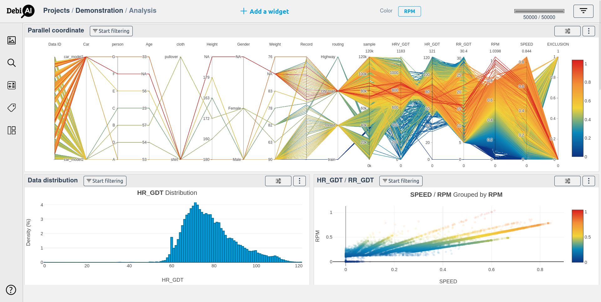
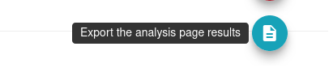

# Generating analysis results

Once you have finished your analysis, you can generate a report with the results.

You can do this in two ways:

- [Generating a full report with all the widgets in the dashboard.](#generating-a-full-report)
- [Downloading an individual image from a widget.](#downloading-individual-images)

## Generating a full report

Let's say you have built a dashboard with several widgets and you want to generate a report with all the widgets in the dashboard:



You can generate a full report by clicking on the "Generate report" button from the side menu:

<p align="center">
    
</p>

This will generate a report with all the widgets in the dashboard and download it as a ZIP file, containing the following files:

```
Project_Analysis.zip
├── analysis.md
├── configurations
│   ├── 1_ParallelCoordinate_Parallel-coordinate.json
│   ├── 2_DistributionPlot_Data-distribution.json
│   └── 3_PointPlot_Point-plot.json
└── images
    ├── 1_ParallelCoordinate_Parallel-coordinate.jpeg
    ├── 2_DistributionPlot_Data-distribution.jpeg
    └── 3_PointPlot_Point-plot.jpeg
```

An `analysis.md` markdown file will be generated summarizing the analysis by listing all the widgets in the dashboard and their configurations.

Here is the [markdown file](./reportExample/analysis.md) generated from the dashboard above.

### Comments

The comments you have added to the widgets will be added to the markdown file.

More information about adding comments to widgets can be found [here](../README.md#what-is-a-widget).

## Downloading individual images

You can also download individual images from a widget by clicking on the "Download image" button from the menu in the top right corner of the widget.

More information about downloading individual images can be found [here](../README.md#what-is-a-widget).
