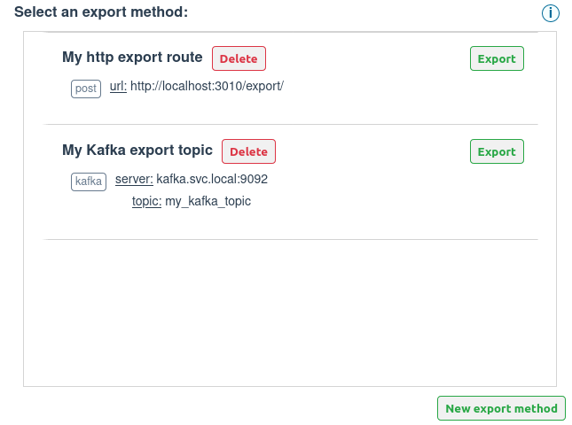
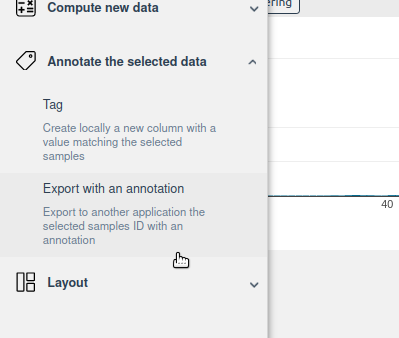
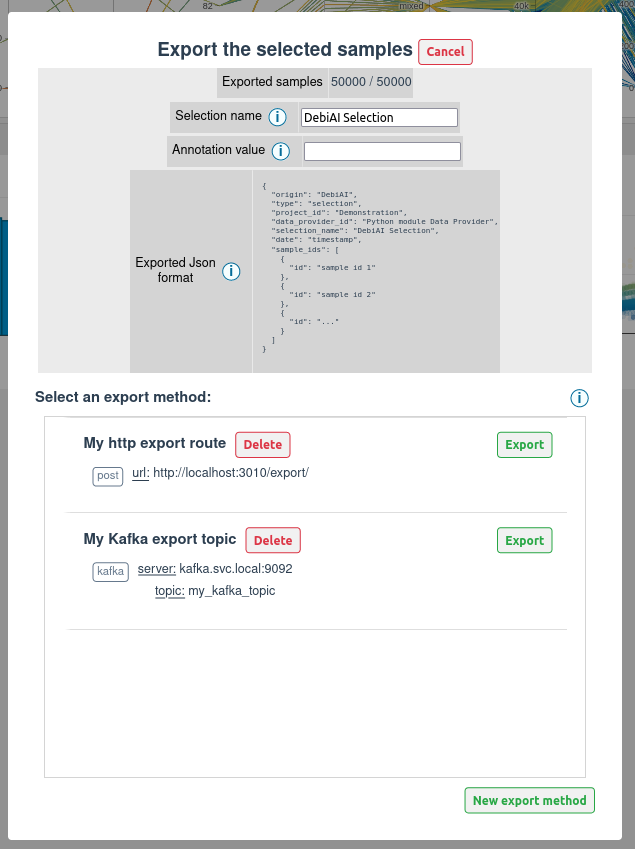
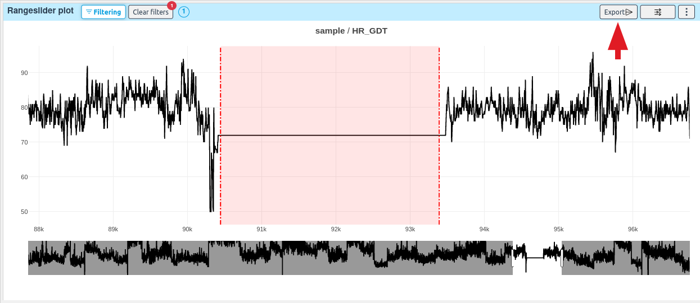

# Exporting data

DebiAI allows you to export data from the analysis page. Those exports can be used to update a database, to analyze samples in another application, to train a model, etc.

There are two ways to export data during an analysis:

- **Selections:** You can export the list of samples id that are selected in the analysis page ([see here](#exporting-the-selected-samples))
- **Annotations:** You can export some widget generated annotations ([see here](#exporting-widget-annotations))

## Setting up export methods

Before exporting some data, you need to define one ore more export method. There are two types of export methods available:
- **HTTP Post request**, which will send a HTTP POST request to the URL you defined.
- **Kafka message**, which will send a message to a Kafka topic.

Once some export methods are defined, you can use them to export your data:

<span style="display:block; color:grey; text-align:center; width:100%; font-size:0.9em">Selection of an export method before exporting a selection</span>

You can define the export method in the [config file](#config-file), the [environment variable](#environment-variable) or directly [in the UI](#dashboard-ui).


### Config file

::: warning
This option is best suited for a development environment. 
:::
You can define the export method in the [`config.ini`](https://github.com/debiai/debiai/blob/main/debiaiServer/config/config.ini) file in the `debiaiServer` backend folder. The following example shows how to define the export method in the `config.ini` file:

This is the sections of the `config.ini` file where you can define the export method:

```ini
[EXPORT_METHODS_CONFIG]
# Configure what a user is allowed to do with export methods
# Allow or not the creation of export methods from the web interface
# (true/false), default is true
creation = true
# Allow or not the deletion of export methods from the web interface
# (true/false), default is true
deletion = true

[EXPORT_METHODS_LIST]
# List all the application export methods according to the available export types
# Available export types: Kafka and HTTP

# Post HTTP export method:
# The HTTP export method will send the data with a post request to the specified URL
# Format: export_method_name = post, <HTTP URL>
; My_PostHTTP_export_method1 = post, http://localhost:3012/export/
; My_PostHTTP_export_method2 = post, http://localhost:5000/annotation/

# Kafka export method:
# The kafka export method will send the data to a kafka broker
# Format: export_method_name = kafka, <Kafka broker URL>, <Kafka topic>
# My_Kafka_export_method = kafka, kafka.svc.local:9092, My_Kafka_topic
```

You can define as many export methods in the `config.ini` file, as shown in the following example:

```ini
[EXPORT_METHODS_LIST]
# Post HTTP export method:
My_PostHTTP_export_method1 = post, http://localhost:3012/export/
My_PostHTTP_export_method2 = post, http://localhost:5000/annotation/

# Kafka export method:
My_Kafka_export_method = kafka, kafka.svc.local:9092, My_Kafka_topic
```

::: warning
The export method target must be reachable by the Debiai backend. For example, if you want to use a local HTTP server, you need to make sure that the backend can reach it.
:::


### Environment variable

::: tip
This option is best suited for a production environment.
:::

You can define the export method and the export method config from the environment variable.

List of supported environment variables:
```ini  
; ==== Export method ====
; Export methods configuration
DEBIAI_EXPORT_METHODS_CREATION_ENABLED=True
DEBIAI_EXPORT_METHODS_DELETION_ENABLED=True

; Post HTTP export method list:
; Env var format: DEBIAI_EXPORT_METHOD_<name>=post, <url>
DEBIAI_EXPORT_METHOD_my_post_export_method1=post, http://localhost:3010/export
DEBIAI_EXPORT_METHOD_my_post_export_method2=post, http://localhost:5000/annotations

; Kafka export method list:
; Env var format: DEBIAI_EXPORT_METHOD_<name>=kafka, <Kafka broker URL>, <Kafka topic>
DEBIAI_EXPORT_METHOD_my_kafka_export_method1=kafka, kafka.svc.local:9092, My_Kafka_topic
DEBIAI_EXPORT_METHOD_my_kafka_export_method2=kafka, kafka.svc.local:9092, My_Kafka_topic
```

We have described how to use the environment variables for a production setup in the [Data-provider setup guide](../../dataInsertion/dataProviders/quickStart.md#environment-variables).

### Dashboard UI

If you want to define the export method directly in the UI, you can do it by clicking on the `New export method` when you are asked to select an export method before exporting your data:


<span style="display:block; color:grey; text-align:center; width:100%; font-size:0.9em">Creation of an export method</span>

::: tip
You can also delete an export method from the UI by clicking on the `Delete` button.

Deleting and creating export methods can be disabled by setting the `creation` and `deletion` parameters to `false` in the config.
:::

Our export methods are very modular, if you need a new type of export method, [you can ask us to implement it](https://github.com/debiai/debiai/issues/new/choose) !

## Exporting data

### Exporting the selected samples

You can export the ID of the samples that are currently selected in the analysis page. To do so, you need to click on the `Export` button on the menu bar:

<p align="center">

<span style="display:block; color:grey; text-align:center; width:100%; font-size:0.9em">Export button</span>
</p>


You will be asked to select an export method and to name your selection:


<span style="display:block; color:grey; text-align:center; width:100%; font-size:0.9em">Selection of an export method before exporting a selection</span>

The exported format is a JSON file with the following format:
```json
{
  "origin": "DebiAI",
  "type": "selection",
  "project_id": <Project ID>,
  "data_provider_id": <Data-provider ID>,
  "selection_name": <Selection name>,
  "date": <Date of the export>,
  "sample_ids": [
    {
      "id": <Sample ID>,
    },
    {
      "id": <Sample ID>,
    },
    ...
  ]
}
```

This JSON file will be sent with the export method that you have selected.

::: tip
You can specify an optional "annotation" field in the JSON file. This field will be added to the exported JSON file.
:::


### Exporting widget annotations

Some widgets can generate data or annotations that you can export with the export method that you have defined. Those widgets are:
  - The [2D Point plot](../widgets/3_point_plot/README.md#how-to-export-the-2d-bounding-box) widget, it can export a 2D bounding box
  - The [Range slider plot](../widgets/range_slider/README.md#how-to-export-the-bounding-range) widget, it can export a range

Simply click on the `Export` button on the top of the widget to export the generated data :

<span style="display:block; color:grey; text-align:center; width:100%; font-size:0.9em">Widget export button</span>
This will open a modal that will ask you to select an export method and to name your selection.

To learn more about the exported format, please refer to the each widget documentation.

Our widget exported data are very modular, if you need a widget to export some data, [you can ask us to implement it](https://github.com/debiai/debiai/issues/new/choose) !
