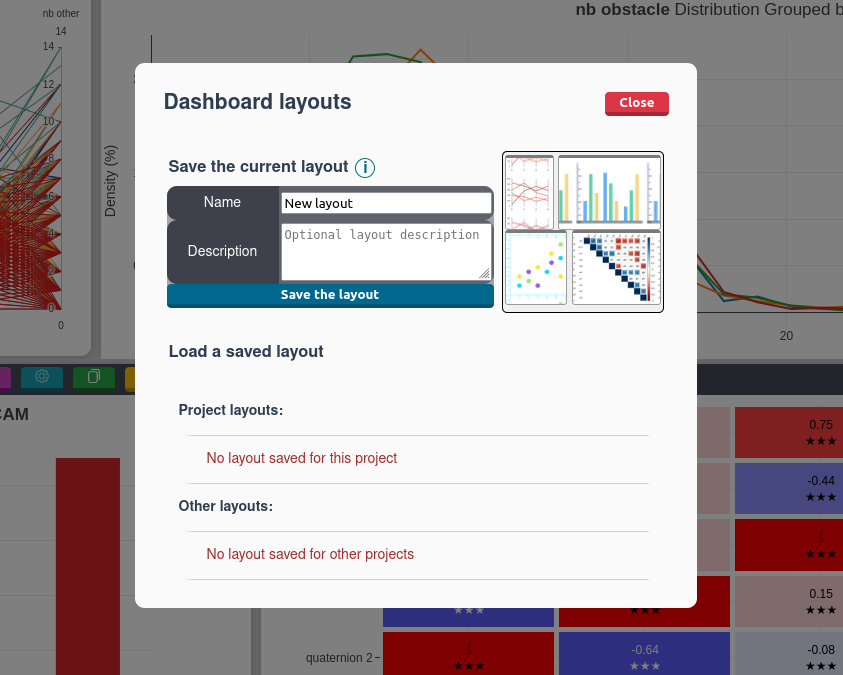
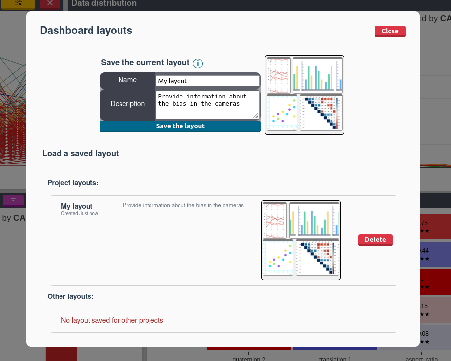

# Layouts

A layout is a collection of widgets that are arranged in a specific way with a specific configuration.
With DebiAI, you can save and load analysis layouts from the dashboard. This allows you to save a layout that you can return to later.

## Saving a layout

Let's say you have opened a project analysis and made a layout that you like and want to save it:

To do this, click the `Save Layout` button in the menu :

This will open a dialog box where you can enter a name for the layout and a description:

Once you have entered a name, click `Save the layout` to save the layout. You can now find it below the `Save Layout` button:

Selecting a layout will change the current layout to the selected one, it will also change the widgets configuration to the one saved in the layout.

You should only have to click on the draw button to display the same data as when you saved the layout.

::: tip
The selected color is also saved in the layout.
:::
::: tip
Layouts are saved idenpendently of the project, so you can use the same layout for different projects.
:::
::: tip
You can clear the current layout by clicking on the `Clear Layout` button and restore the default layout by clicking on the `Restore Default Layout` button:

:::

::: warning
Some columns may not be available when loading a layout if they are not present in the current project. This can be the case for columns that were added:

- virtualy
- that are the result of a tag
- that are the result of an algorithm
- that are the result of a model and you are not analyzing model results.

A warning message will be displayed if this is the case.
:::
::: warning
The results after re-drawing the plots may not be the same as when you saved the layout. There are several reasons for this:

- The plot may have been generated when some filters were applied
- The data or model results may have changed since the layout was saved
- You are using a different project
  :::
