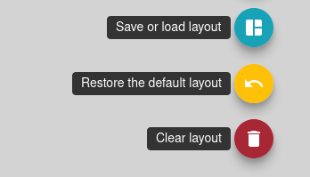
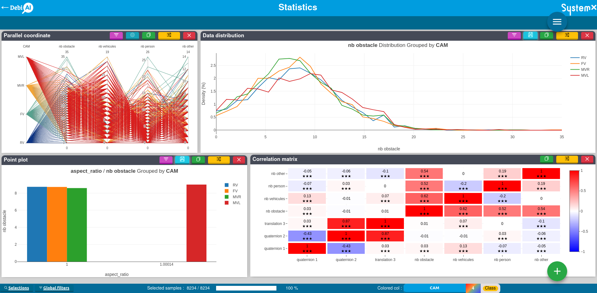
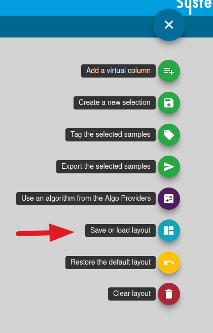
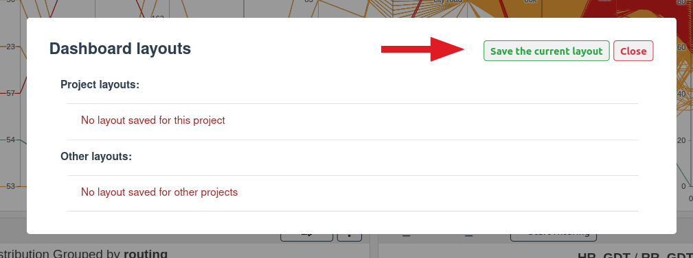
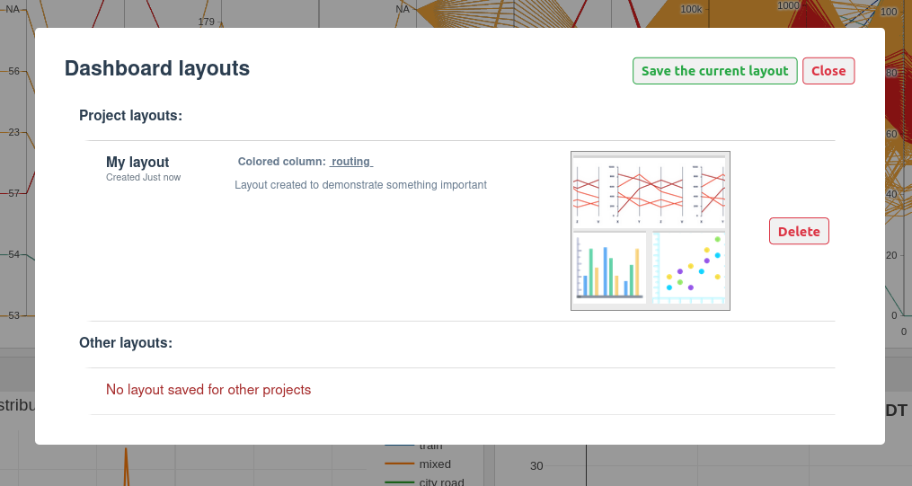

# Layouts

A layout is a collection of widgets that are arranged in a specific way with a specific configuration as well as the selected colored column.

With DebiAI, you can save and load analysis layouts from the dashboard. This allows you to save a layout that you can return to later.

::: tip
You can clear the current layout by clicking on the `Clear Layout` button and restore the default layout by clicking on the `Restore Default Layout` button:

This default layout is the one that is loaded when you open a new project. It is fixed and cannot be modified at the moment.
:::

## Saving a layout

Let's say you have opened a project analysis and made a layout that you like and want to save it:

To do this, click the `Save Layout` button in the menu :

This will open a dialog box where you can enter a name for the layout and a description:

Once you have entered a name, click `Save the layout` to save the layout. You can now find it below the `Save Layout` button:

Selecting a layout will change the current layout to the selected one, it will also change the widgets configuration to the one saved in the layout.

To avoid heavy loading time, widgets will not be displayed by default when loading a layout, you will have to click on the draw button to display the data.
::: tip
Layouts are saved independently of the project, so you can use the same layout for different projects.
:::

::: warning
Some columns may not be available when loading a layout if they are not present in the current project. This can be the case for columns that were added:

- virtually,
- as a tag,
- as an algorithm output,
- by loading model results.

A warning message will be displayed if this is the case and a default column will be used instead.
:::
::: warning
The results after re-drawing the plots may not be the same as when you saved the layout. There are several reasons for this:

- you are using a different project, selection or model,
- the data or model results may have changed since the layout was saved,
- the plot may have been generated when some filters were applied.
  :::
