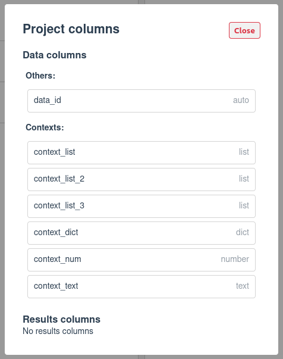
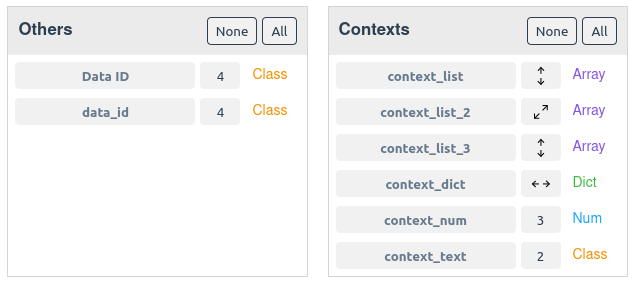
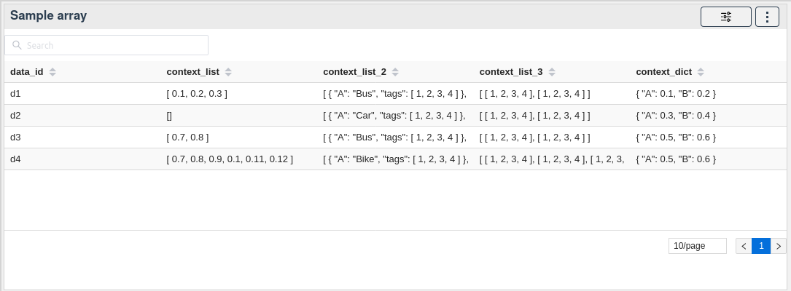
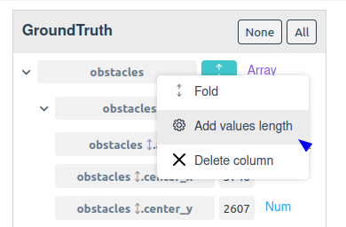
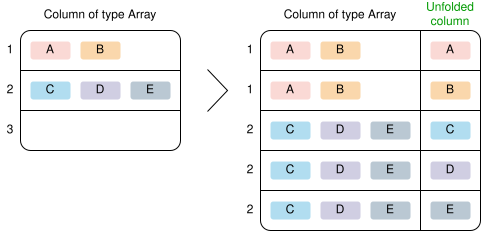
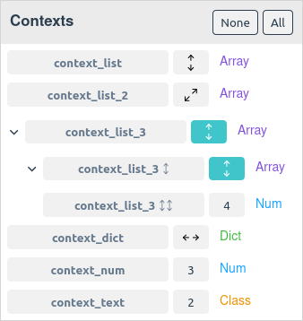
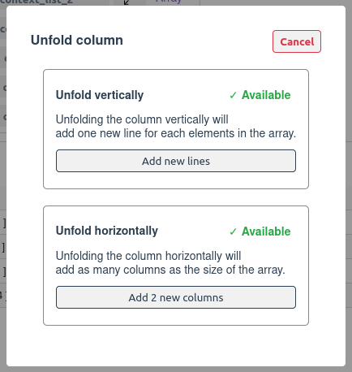
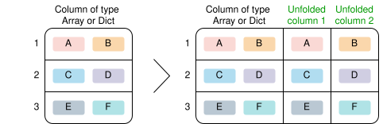
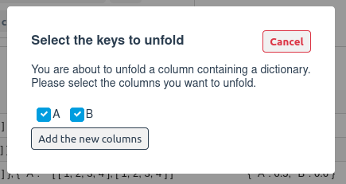
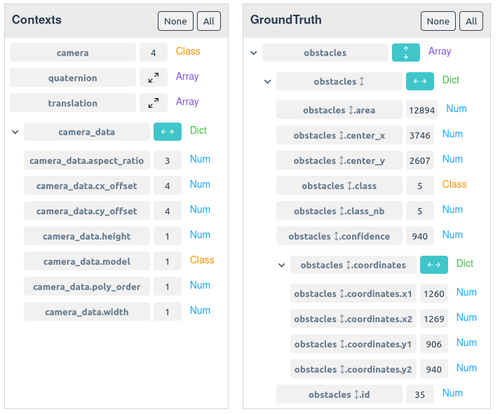

# Unfolding arrays and dictionaries columns

DebiAI 0.28.0 introduces a new feature that allows you to provide arrays and dictionaries as columns in the data source.

In the data-analysis dashboard, arrays and dictionaries can't be used as columns for most widgets (apart from the Sample array widget). They can, however, be unfolded into new lines and columns that are compatible with the widgets.

The process of unfolding columns enables the exploration of the project's data, regardless of their dimensions. For example, you can analyze the [Woodscape](../../tutorials/woodscapeTutorial/) images and obstacles data without having to create one project for each project dimension.

::: warning Disclaimer
Unfolding columns is an advanced feature of DebiAI that might be instable in some cases. If you encounter any issue, please write an issue on our [GitHub repository](https://github.com/debiai/DebiAI/issues/new/choose)
:::

## Arrays and dictionaries in the dashboard

After inserting arrays or dictionaries data using one of our [insertion methods](../../dataInsertion/), they will be displayed in the dashboard like any other column.

In the project page:

In the data-analysis page columns:

In the sample array widget:

### Arrays metrics

You can generate new columns from the arrays columns by right-clicking on the column name and selecting the desired metric:

At the moment, the following metrics are available:

- `Values length`: Add a `num` column with the length of the column's array

## Unfolding arrays and dictionaries

There are two ways to unfold arrays and dictionaries columns:

-  [Vertical unfolding](#vertical-unfolding): Add as many new lines as the number of elements in the array
-  [Horizontal unfolding](#horizontal-unfolding): Add as many new columns as the number of elements in the array or keys in the dictionary

::: tip Note
Columns that can be unfolded vertically and horizontally are marked with the following icon:

:::

### Vertical unfolding

Unfolding vertically is only available for arrays. It creates new lines for each element in the array, duplicating the other columns' values. A new column is created containing the element's value.

- Arrays with fixed size: Supported
- Arrays with variable size: Supported
- Arrays with variable content type: Supported but not recommended
- Dictionaries with fixed keys: Not supported
- Dictionaries with variable keys: Not supported

This unfolding method is useful when you want to increase the analysis dimension by analyzing the individual elements of the array. For example, if you have a column with a list of tags, you can unfold it to analyze the distribution of each tag.

::: tip Note
If an array is empty, the unfolding won't create new lines for it (as shown in the example above with sample 3).
:::

To unfold an array, click on the  or the  icon.

::: tip Note
Vertical unfolding can be used recursively (as shown in the example above).
:::

A menu will appear with the option to unfold the column vertically or horizontally.

Select the desired unfolding method to create new lines or columns. To fold the column back, click on highlighted unfold icon back.

::: warning Disclaimer
Unfolding columns vertically can create a large number of new lines, which can slow down the analysis and increase the memory usage. Use this feature with caution.
:::

### Horizontal unfolding

Unfolding horizontally is available for dictionaries and arrays with a fixed size. It creates new columns for each element in the array or key in the dictionary.

- Arrays with fixed size: Supported (up to size 8)
- Arrays with variable size: Not supported
- Arrays with variable content type: Supported but not recommended
- Dictionaries with fixed keys: Supported (up to 30 keys)
- Dictionaries with variable keys: Not supported

To unfold an array, click on the 

A menu will appear with the option to unfold the column vertically or horizontally.

Select the keys that you want create new columns for and click on the "Add the new columns" button.
The new columns will be created from the selected keys, they can be used in the widgets as any other column.

::: tip Note
Horizontal unfolding can be used recursively (as shown in the example above).
:::

To fold the column back, click on highlighted unfold icon back.

