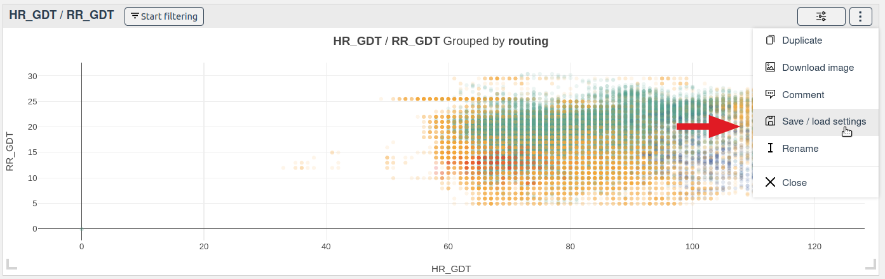
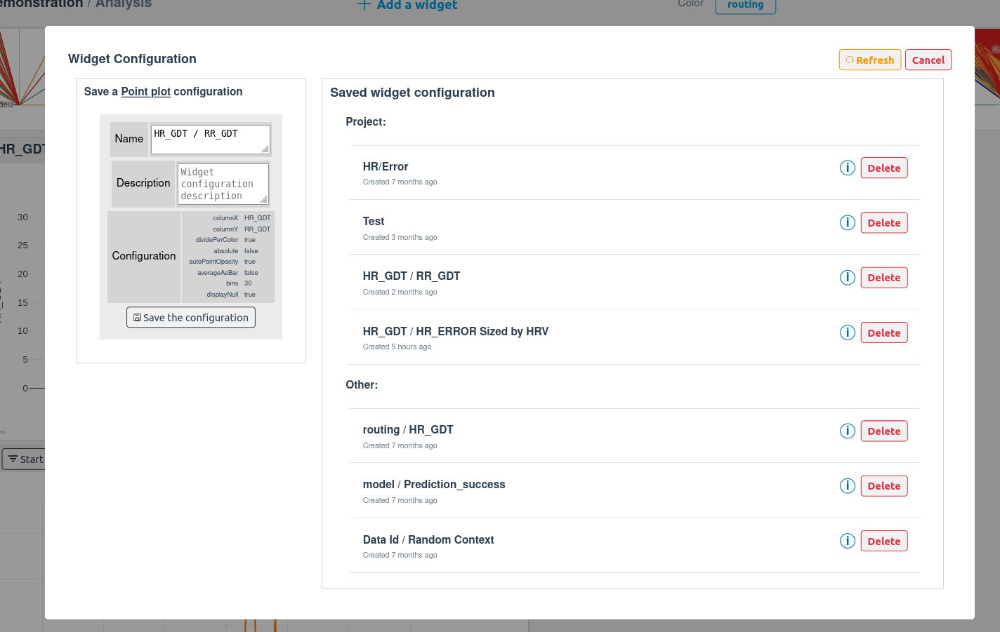
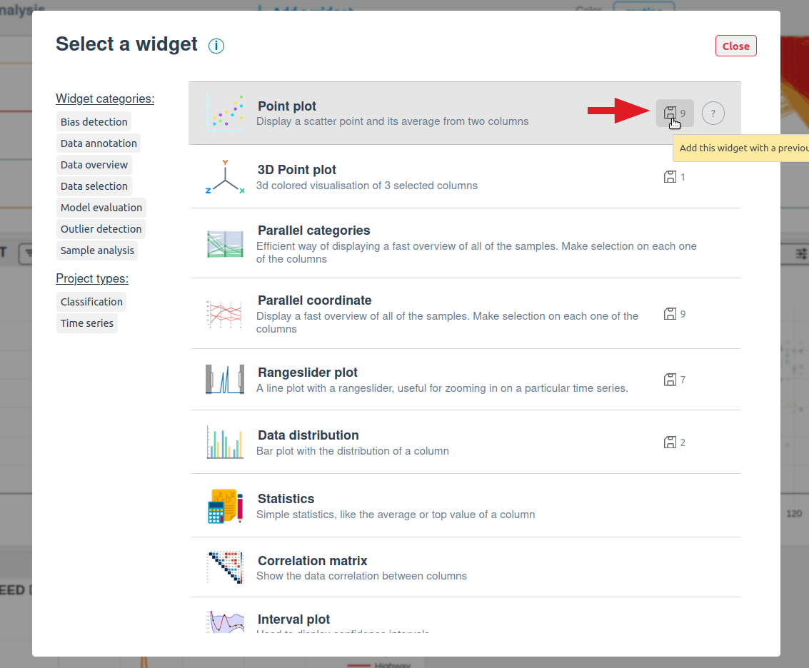
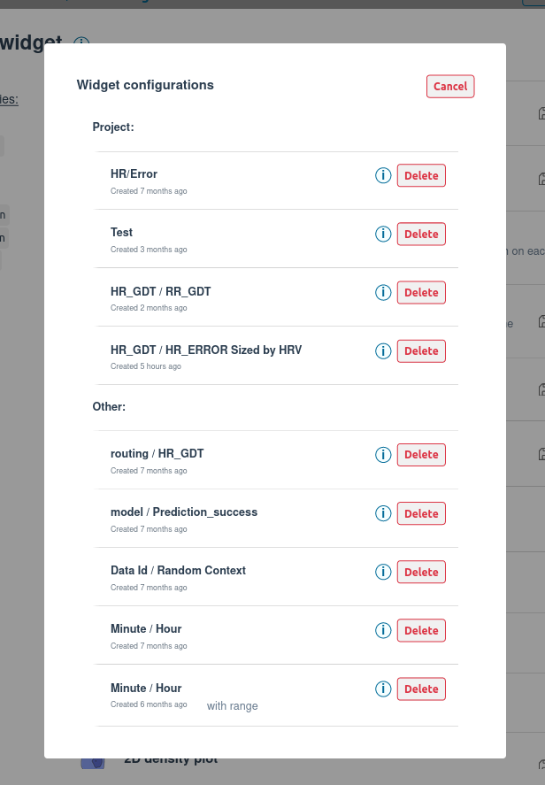
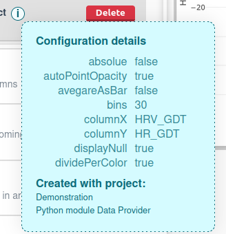

# Widget configurations

## Saving a widget configuration

You can save the configuration of a widget in order to reuse it later, most of our widgets support this feature. To find out if a widget supports this feature, you can check if the `Widget configuration` button is present on the widget menu bar:

If the button is present, you can save the current configuration of the widget by clicking on it. This will open a modal that will ask you to name your configuration:

You can also add an optional description to your configuration.

After clicking on the `Save the configuration` button, your configuration will be saved and you will be able to reuse it later.

## Loading a widget configuration

The widget configurations that you have saved are available in the `Widget configuration` modal. To load a widget configuration, you just need to click on the configuration that you want to load.

This will replace the widget actual configuration with the one that you have selected. 

You can also select a widget configuration from the widget catalog. To do so, you need to select a widget with saved configurations and click on the configuration that you want to load:

The `gear` icon indicates how many configurations are available for the widget.

Note that a widget configuration saved by other projects will be available in the widget configuration list, they will be listed as `Other configurations`:

    

::: warning
It may append that a widget configuration is not compatible with the current project for example if the widget configuration was saved with a different project or when some models where selected. 

In this case, loading the widget configuration will warn you of which columns are not compatible with the current project and will not load them.
:::

::: tip
A widget configuration may not be enough to reproduce the exact same widget. For example, if the selected colors is not the same as the one used when the widget configuration was saved. 

If the selected color does matter, you can write a comment in the description of the widget configuration to explain how to reproduce it the exact same way. 
:::

::: tip
To read the complete configuration of a widget, you can hover the configuration `(i)`icon. This will display the complete saved configuration:

    

:::

## Deleting a widget configuration

You can delete any widget configuration that you have saved. To do so, click on the `Delete` button on the widget configuration that you want to delete.
