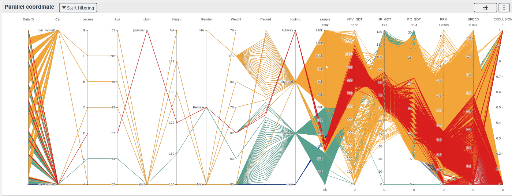
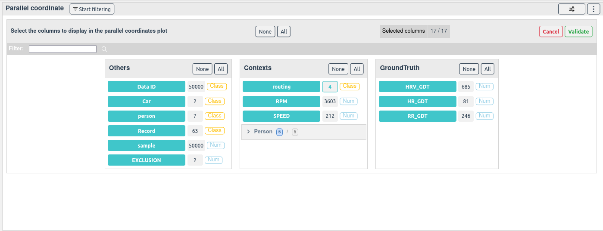
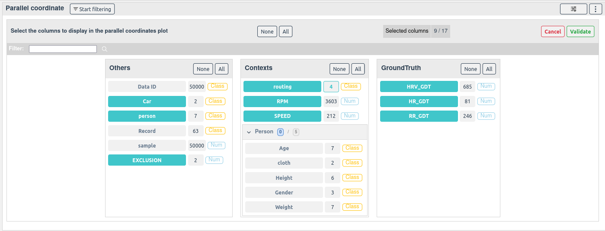
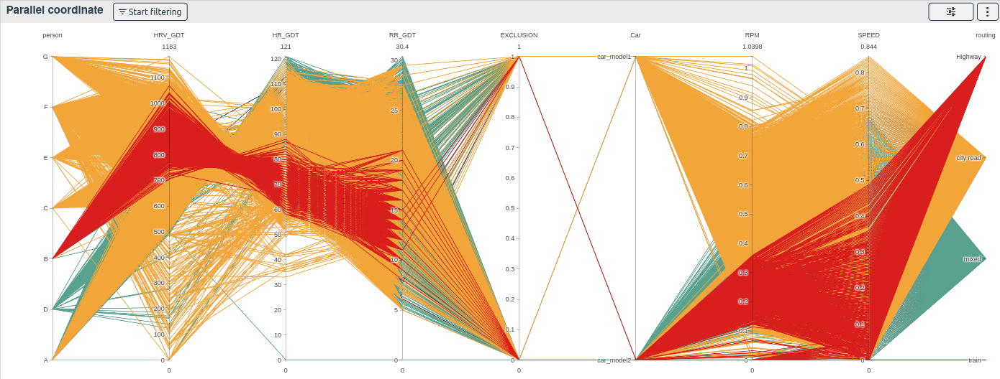
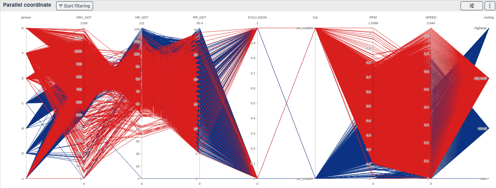
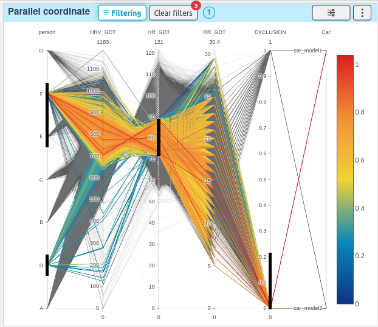
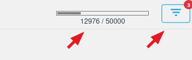
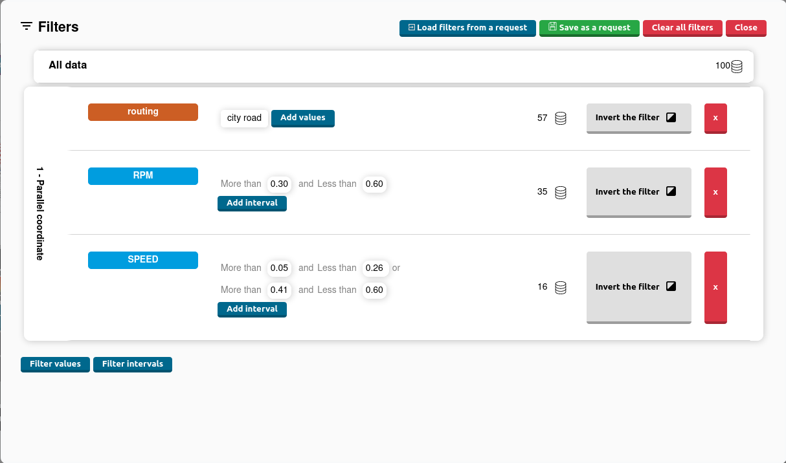

# Parallel coordinates

[[`Data overview`](../README.md#data-overview)]
[[`Outlier detection`](../README.md#outliers-detection)]
[[`Bias detection`](../README.md#bias-detection)]
[[`Data selection`](../README.md#data-selection)]

The parallel coordinates widget allows you to rapidly get an **overview of your data**. If data is missing, is inconsistent, or is not in a proper format, the widget will help you quickly find the problem.

It is also a very good tool for **data selection**.

### How to use the widget:

Select all the columns that you want to be displayed in the parallel coordinate.

Notice the `All` and `None` buttons that will help you select your columns faster

Once selected, click on the `Validate` button to display the columns in the parallel coordinate

The plot is colored by the selected color column unique values.

You can select samples by drawing one or more squares on the columns

The percentage and the number of selected samples is displayed at the bottom of the screen and the other plots will display only the selected samples.

To clear the filters, click on them, double click on the column, click on the `clear filters` button or go in the filters menu.

