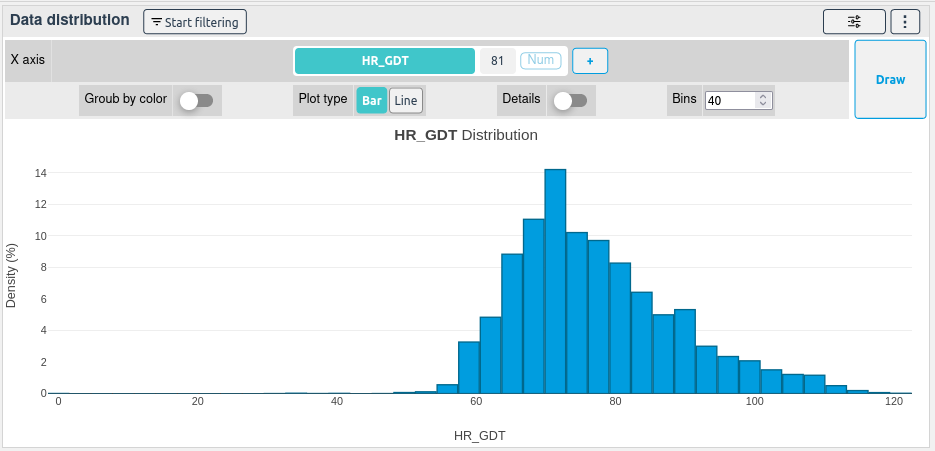
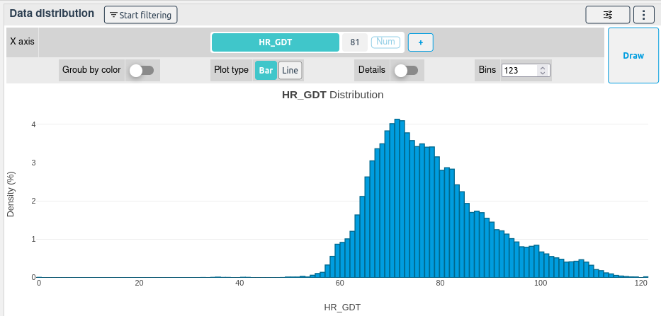
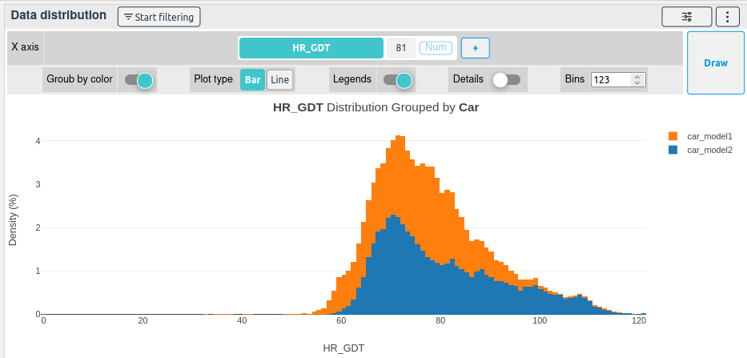
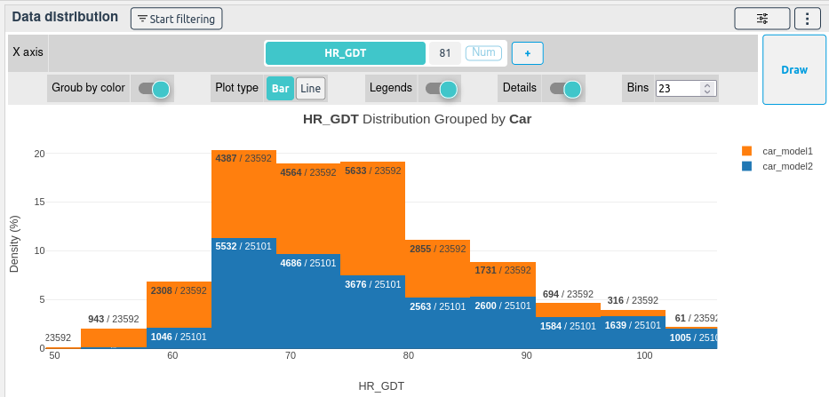
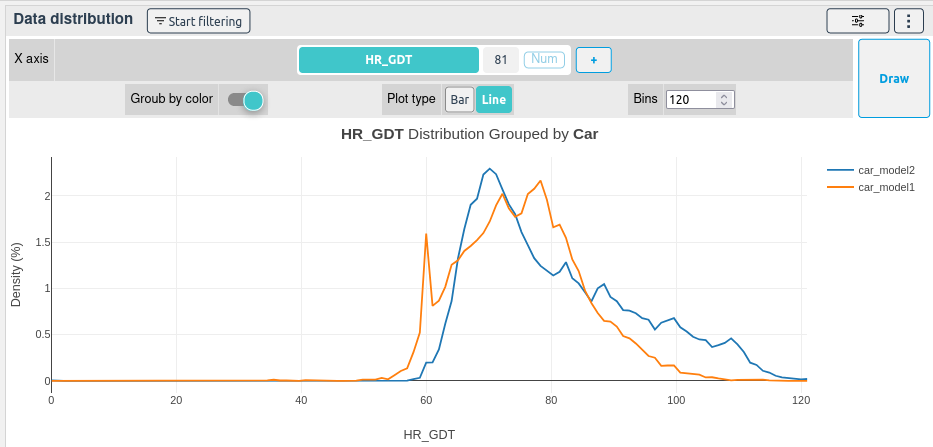

# Data distribution

[[`Data overview`](../README.md#data-overview)]
[[`Bias detection`](../README.md#bias-detection)]

**How to use the Data distribution widget**

Select a column of your choice, once selected, the column distribution will be immediately displayed.

By changing the **Bins** and after redrawing the plot by clicking on **Draw**, the distribution will be sliced more or less precisely.

If **Group by color** is checked, the distribution will be displayed for each one of the selected colored column unique values.

You can hide the points or the average by clicking on them in the legend. You can also zoom on a part of the plot by drawing a square on it.

By selecting the **Details** option, the number of occurrences of each unique value and group will be displayed.

Finally, you can display the distribution as a line plot by selecting the **Line** button and by drawing the plot again.

