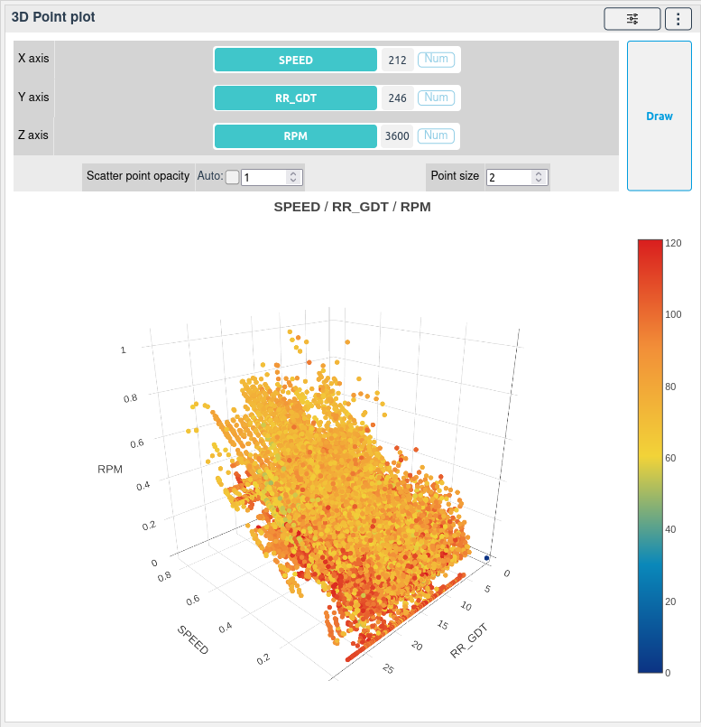

# 3D point plot

[[`Data overview`](../README.md#data-overview)]
[[`Bias detection`](../README.md#bias-detection)]
[[`Outlier detection`](../README.md#anomaly-detection)]
[[`Model evaluation`](../README.md#model-evaluation)]

The 3D point plot widget shows the distribution of the data points in a 3D space. The widget can be used to detect anomalies in the data points.

The widget can also be used to compare the models error accoding to two different features.

<!-- 
**How to use the widget**

 -->
