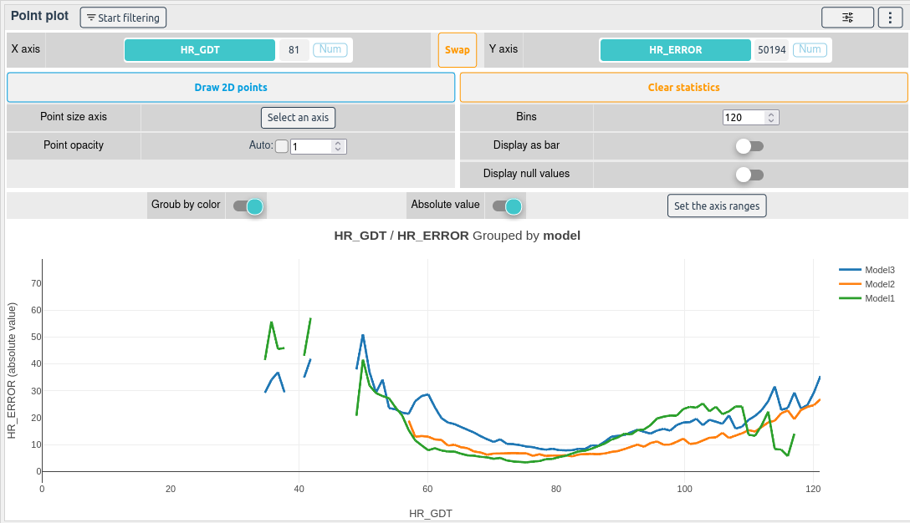
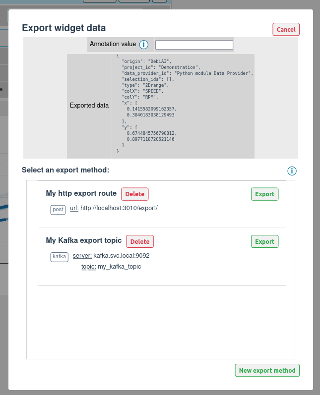

# Point plot

[[`Data overview`](../README.md#data-overview)]
[[`Sample analysis`](../README.md#sample-analysis)]
[[`Bias detection`](../README.md#bias-detection)]
[[`Outlier detection`](../README.md#outliers-detection)] \
[[`Model evaluation`](../README.md#model-evaluation)]
[[`Data selection`](../README.md#data-selection)]
[[`Data annotation`](../README.md#data-annotation)]
[[`Data export`](../README.md#data-export)]


The point plot widget displays points and averages in 2D space.

It is one of the best way to compare your models' performances with the project contexts. Set the error or success on the Y axis, a context on the X axis and color of the models.

### How to use the widget

First, select the X and Y columns of your choice


You can then display a 2D Point cloud with the `Draw 2D points` button, some statistics with the `Draw statistics` or both by clicking on the two buttons.


:::tip
You can hide the points or the average by clicking on the elements in the legend.

You can also zoom on a part of the plot by drawing a square on it.
:::

If a column is selected as a color, the points will be colored and the statistics will be grouped according to the selected column.


Checking `Display absolute value` will update plot and display the absolute values of the selected Y axis column.


By increasing the `Bins`, the statistical operations will be more precise.



You can also display the statistics as a bar chart by clicking on the `Display as bar` button.


This option is useful when the x axis column is a categorical column.

### How to select samples with a box

To start filtering samples with the point plot, click on the **Start filtering** button.


Then draw a selection box on the plot.


The filters and the selected samples will be updated.


### How to export the 2D bounding box

This widget allows you to export the 2D bounding box.

Once you have drawn a selection box on the plot, you can export the data of the 2D bounding box by clicking on the `Export` button on the top right side of the widget.

You will be prompted to choose the export method ([Learn more](../../dataExport/README.md#setting-up-export-methods)).



The export format is the following:

```json
{
  // Generic data
  "origin": "DebiAI",
  "projectId": <Project Id>,
  "dataProviderId": <Data-provider Id>,
  "selectionIds": [<Analysis selection Ids>],

  // Widget data
  "type": "2Drange",
  "colX": <Selected X column name>,
  "colY": <Selected Y column name>,
  "x": [<X min value>, <X max value>],
  "y": [<Y min value>, <Y max value>]
}
```

Here is an example of the exported data:

```json
{
  "origin": "DebiAI",
  "projectId": "Python module Data Provider",
  "dataProviderId": "Demonstration project",
  "selectionIds": [],

  "type": "2Drange",
  "colX": "HRV_GDT",
  "colY": "RR_GDT",
  "x": [744.2689822294022, 1153.6949380721594],
  "y": [24.28664396519107, 26.817101778282257]
}
```

This data will be sent to the selected export method.

::: tip
You can specify an optional "annotation" field in the JSON file. This field will be added to the exported JSON file.
:::
