# Point plot

[[`Data overview`](../README.md#data-overview)]
[[`Bias detection`](../README.md#bias-detection)]
[[`Outlier detection`](../README.md#anomaly-detection)]
[[`Model evaluation`](../README.md#model-evaluation)]
[[`Data selection`](../README.md#data-selection)]

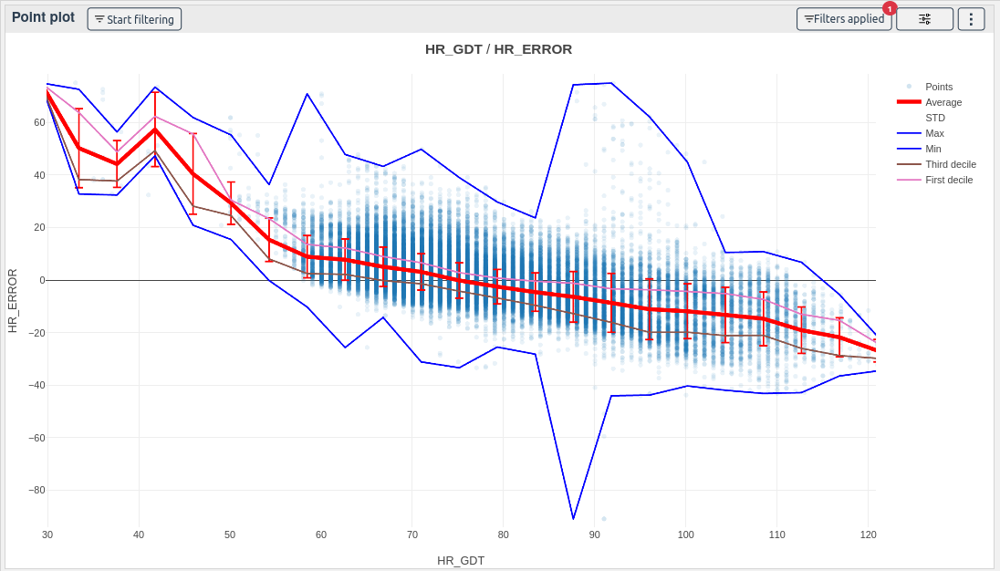

The point plot displays points in 2D space and averages.

It is one of the best way to compare your models' performances with the project contexts. Set the error or success on the Y axis, a context on the X axis and color of the models.

**How to use the widget**

First, select the X and Y columns of your choice

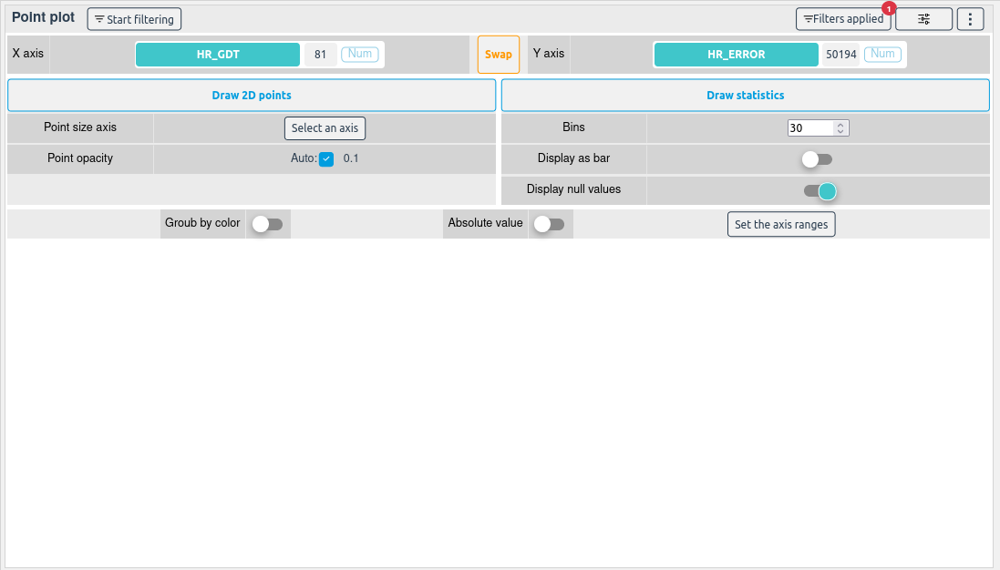

You can then display a 2D Point cloud with the **Draw 2D points** button, some statistics with the **Draw statistics** or both by clicking on the two buttons.

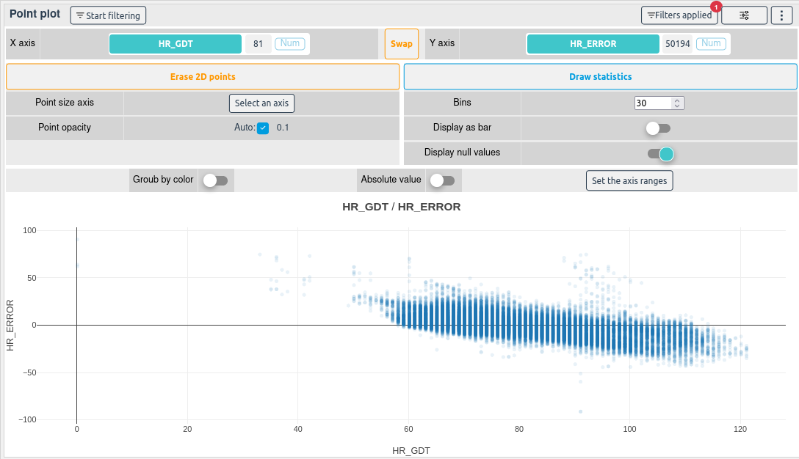
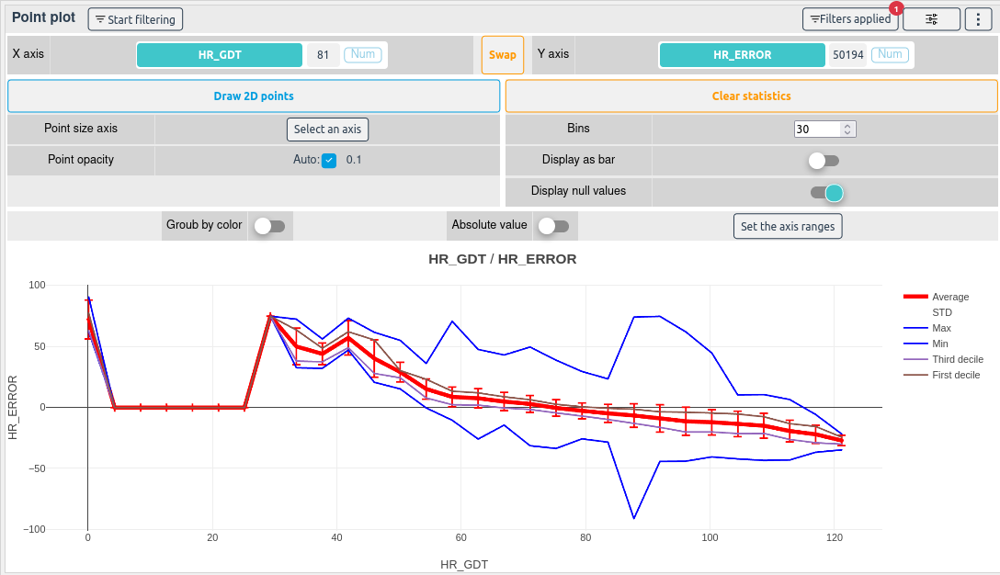
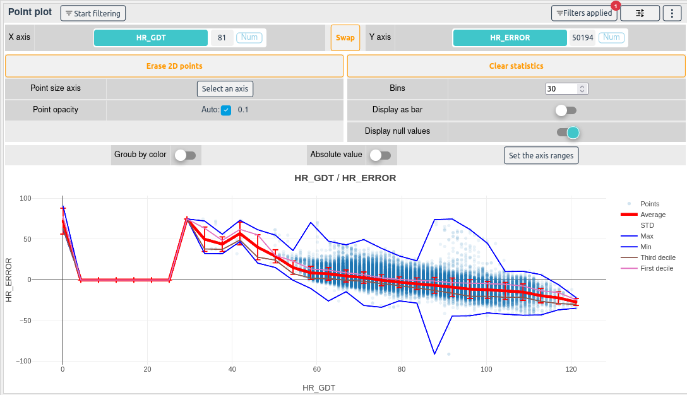

If a column is selected as a color, the points will be colored and the statistics will be grouped according to the selected column.

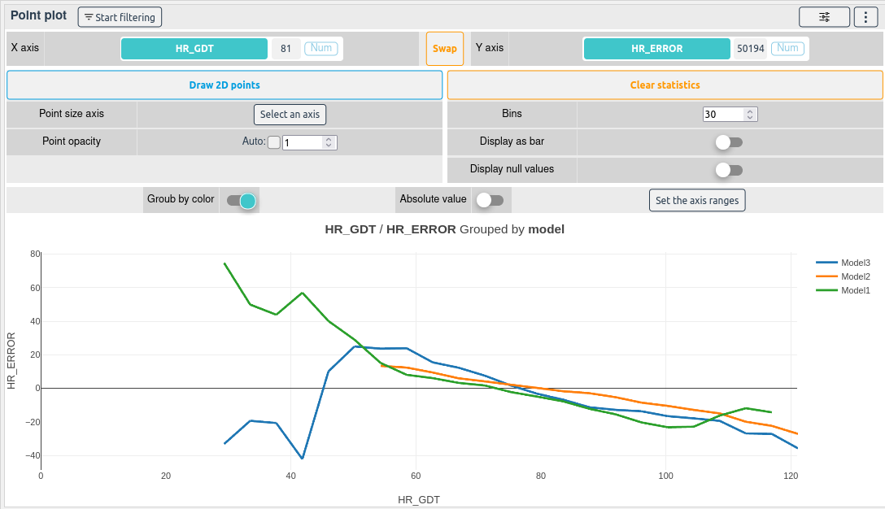

Checking **Display absolute value** will update plot and display the absolute values of the selected Y axis column.

By increasing the **Bins**, the statistical operations will be more precise.

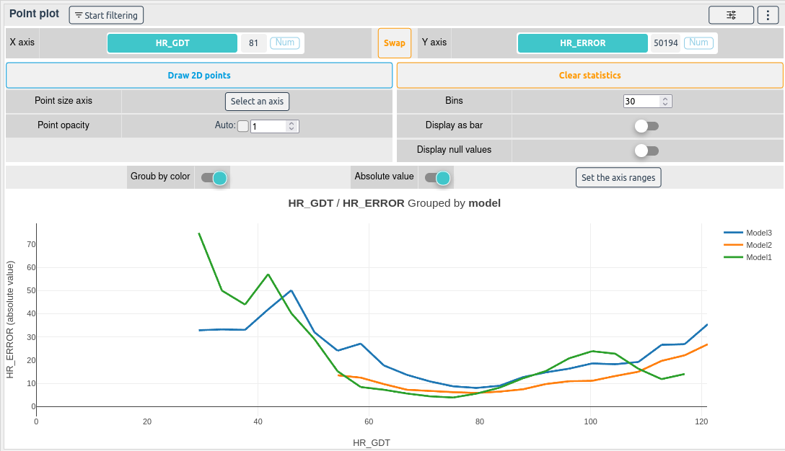

You can also display the statistics as a bar chart by clicking on the **Display as bar** button.

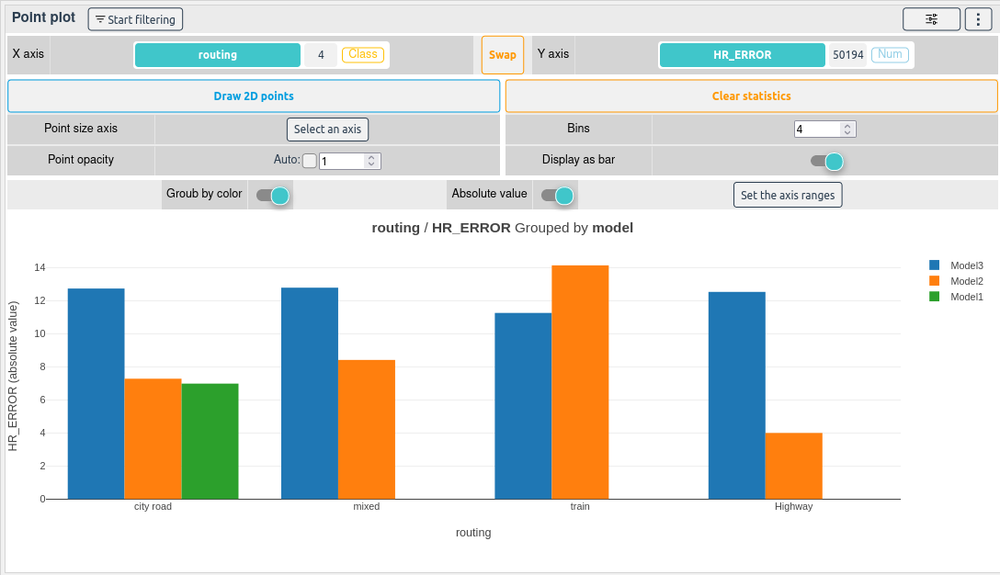

You can hide the points or the average by clicking on them in the legend. You can also zoom on a part of the plot by drawing a square on it.

**How to select samples with the point plot widget**

To start filtering samples with the point plot, click on the purple Filter button.

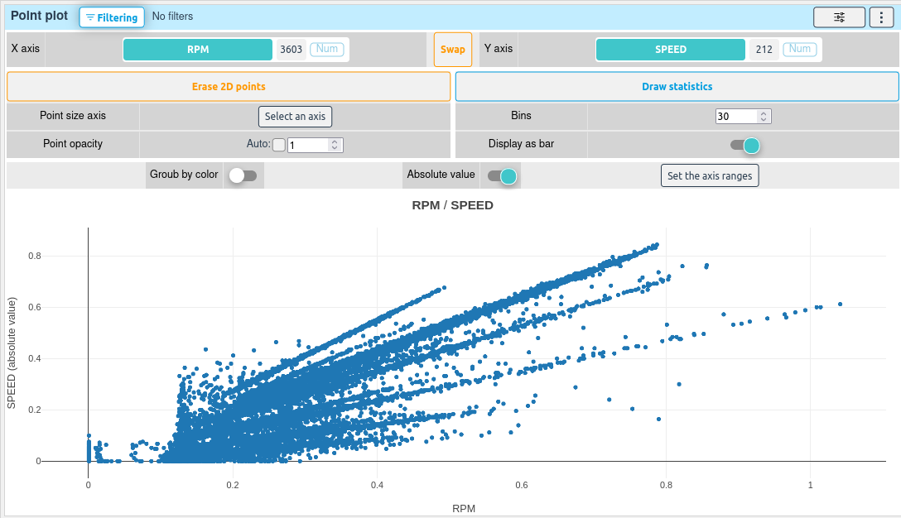

Then draw a selection box on the plot.

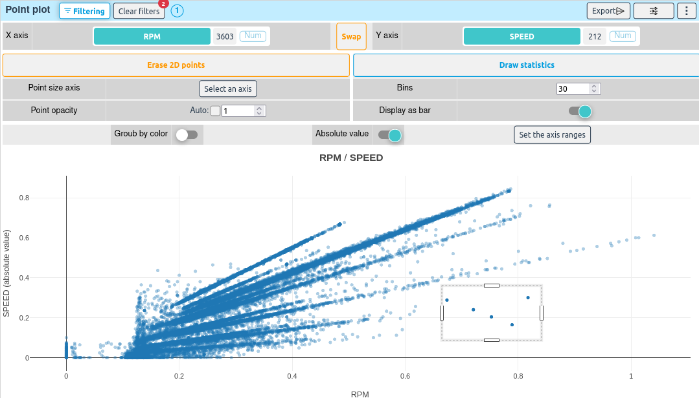

The filters and the selected samples will be updated.

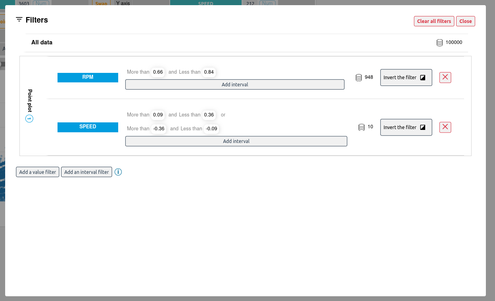

