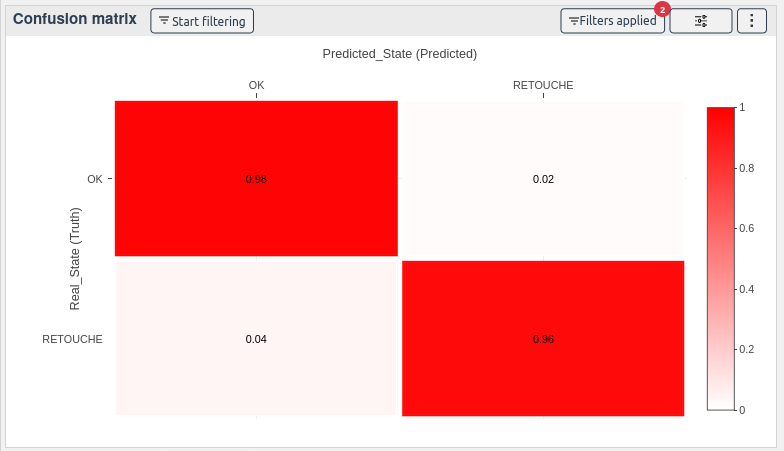

# Confusion matrix

[[`Model evaluation`](../README.md#model-evaluation)]
[[`Classification`](../README.md#classification)]

The confusion matrix widget is useful for classification problems. It shows the number of true positives, true negatives, false positives, and false negatives.

By selecting the models as color, you can display a confusion matrix for each model.

<!-- **How to use the widget** -->

<!--  -->
