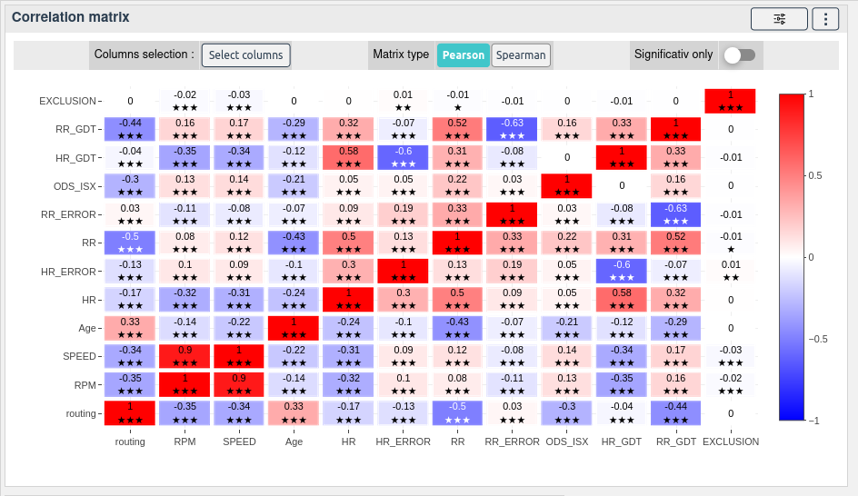

# Correlation matrix

[[`Data overview`](../README.md#data-overview)]
[[`Bias detection`](../README.md#bias-detection)]
[[`Model evaluation`](../README.md#model-evaluation)]

The correlation matrix widget shows the correlation between the features of the data set. The correlation is calculated using the Pearson correlation coefficient. 

The widget also shows the p-value of the correlation. The p-value is the probability that the correlation is not significant. 
<!-- The p-value is calculated using the Student's t-test. -->

<!-- **How to use the widget** -->

<!--  -->
