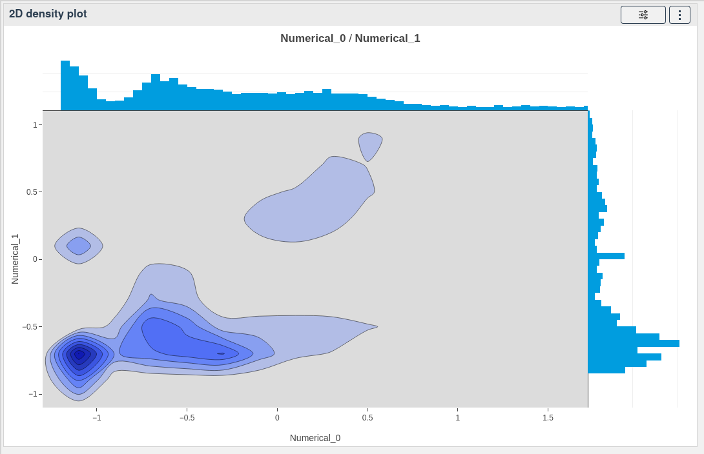

# 2D density plot

[[`Data overview analysis`](../README.md#data-overview)]

The 2D density plot widget allows you to visualize the density of your data in 2 dimensions. It is a good way to visualize the distribution of your data and to identify clusters.

