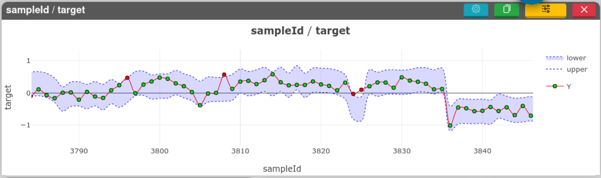

# Interval plot

[[`Sample visualization`](../README.md#data-overview)]
[[`Model evaluation`](../README.md#model-evaluation)]
[[`Time series`](../README.md#time-series)]

The interval plot can shows trust intervals for time series data.

<!-- 
**How to use the widget**

 -->
