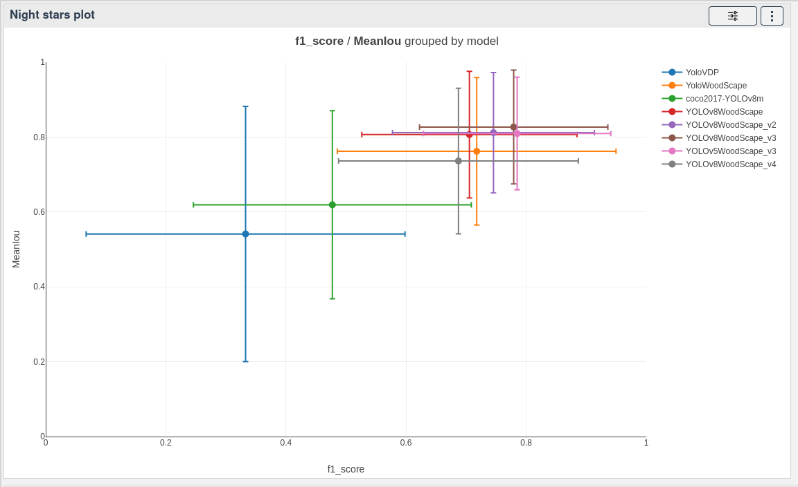

# Night stars plot

[[`Model evaluation`](../README.md#model-evaluation)]

The night stars plot shows the average and standard deviation of different categories according to 2 axis. It is useful to compare the performance of different models with 2 different metrics.

It is recommended to use this widget with your models as color and your contexts or error metrics as X axis and Y axis.