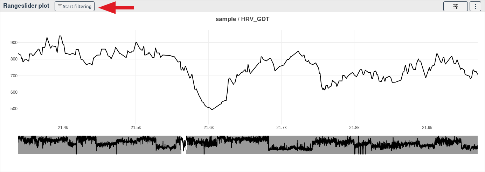
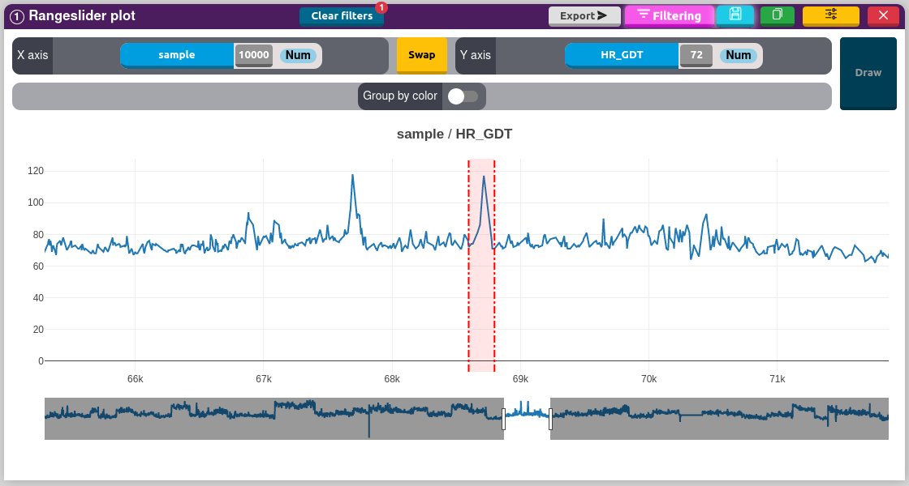
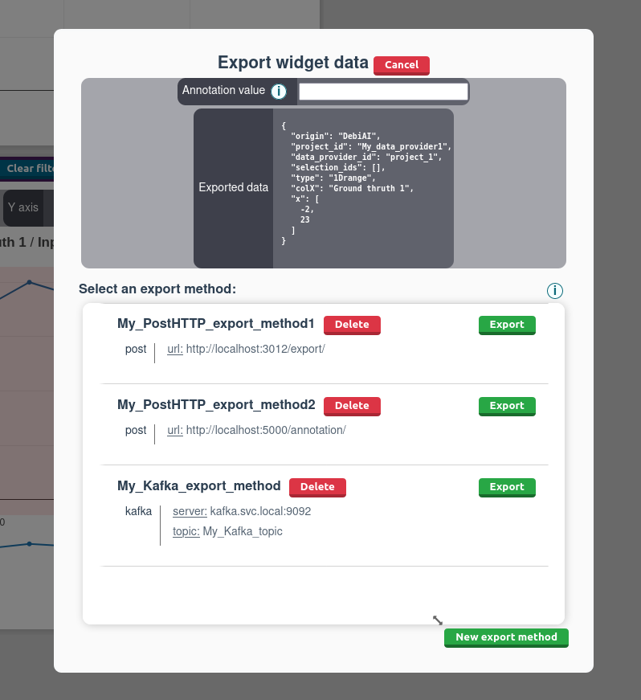

# Range slider plot

[[`Sample analysis`](../README.md#sample-analysis)]
[[`Outlier detection`](../README.md#outlier-detection)]
[[`Model evaluation`](../README.md#model-evaluation)]
[[`Time series`](../README.md#time-series)]
[[`Data export`](../README.md#data-export)]


## How to select samples with a 1D range

To start filtering samples with the point plot, click on the purple Filter button.


Then click on two different points on the plot.


This will create a 1D selection range and update the filters and the selected samples.

## How to export the bounding range

This widget allows you to export the 1D bounding box.

Once you have drawn a selection range on the plot, you can export the data of the bounding range by clicking on the `Export` button on the top right side of the widget.



You will be prompted to choose the export method ([Learn more](../../dataExport/README.md#setting-up-export-methods)).
The export format is the following:

```json
{
  // Generic data
  "origin": "DebiAI",
  "projectId": <Project Id>,
  "dataProviderId": <Data-provider Id>,
  "selectionIds": [<Analysis selection Ids>],

  // Widget data
  "type": "1Drange",
  "colX": <Selected X column name>,
  "x": [<X min value>, <X max value>],
}
```

Here is an example of the exported data:

```json
{
  "origin": "DebiAI",
  "projectId": "Python module Data Provider",
  "dataProviderId": "Demonstration project",
  "selectionIds": [],

  "type": "1Drange",
  "colX": "sample",
  "x": [
    68596,
    68797
  ]
}
```

This data will be sent to the selected export method.

::: tip
You can specify an optional "annotation" field in the JSON file. This field will be added to the exported JSON file.
:::