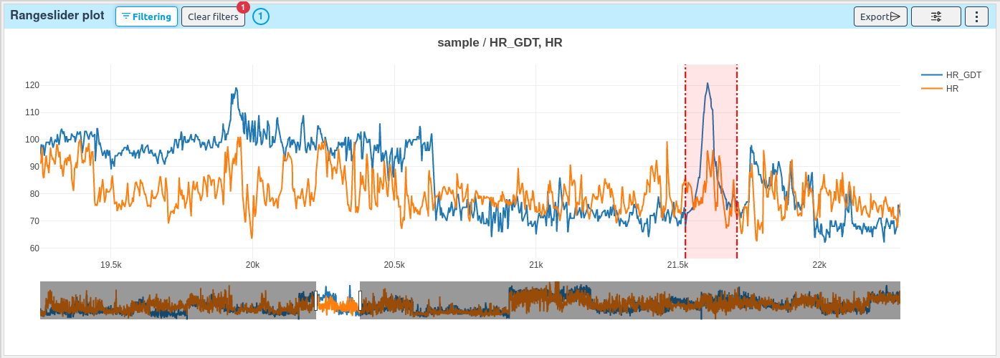

# Range slider plot

[[`Sample analysis`](../README.md#sample-analysis)]
[[`Outlier detection`](../README.md#outlier-detection)]
[[`Model evaluation`](../README.md#model-evaluation)]
[[`Time series`](../README.md#time-series)]

