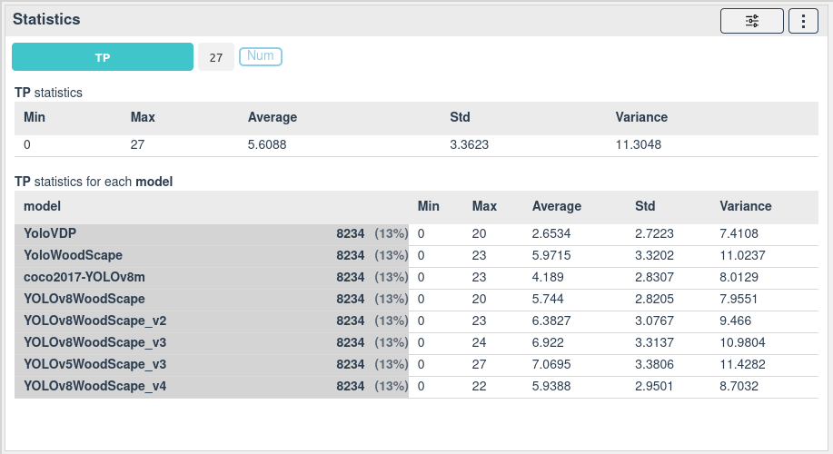

# Satistics

[[`Bias detection`](../README.md#bias-detection)]
[[`Model evaluation`](../README.md#model-evaluation)]

Display the average, standard deviation, and minimum and maximum values of the selected data points for a feature.

By selecting a color, you can display the satistics for each colored column unique value.

You can, for example, use this widget to display the average error for each models or for each value of a specific context.