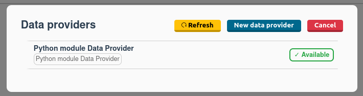
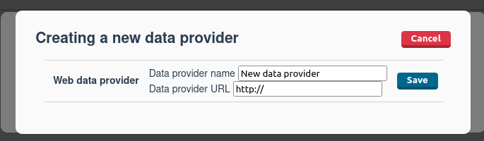
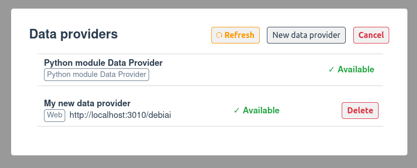

# Quick start

## Creation of a data provider

To help you with the creation of data-providers, we have created some quick start templates. At the moment the templates are available for the following languages:

- Node.js : [https://github.com/debiai/data-provider-nodejs-template](https://github.com/debiai/data-provider-nodejs-template)

If you think that we should add a template for another language, [please let us know](https://github.com/debiai/data-provider-nodejs-template/issues/new).

::: tip Starting from scratch
You can create your own data-provider as long as the [API](https://petstore.swagger.io/?url=https://raw.githubusercontent.com/debiai/data-provider-nodejs-template/main/data-provider-API.yaml) is respected.
:::

## Giving DebiAI access to a data provider

Once you have created and deployed your data provider, you need to tell DebiAI where to find it.

You can do this in three ways:

- [From the dashboard](#from-the-dashboard)
- [With the environment variables (recommended)](#environment-variables)
- [With the configuration file](#configuration-file)

::: warning
DebiAI needs to be able to access your data provider.

If your data provider is deployed on the same machine as DebiAI, you can use `localhost` as the URL of your data provider, if not, you need to use the public IP address of your data provider.

If you are using docker, you may need to use the public IP address of your data-provider or use the `--network host` option to reach a data-provider deployed on localhost.
More information on the [docker documentation](https://docs.docker.com/network/host/).
:::

### From the dashboard

If you are using the DebiAI dashboard, you can add your data provider from the home page. First, click on the `Manage data providers` button on top of the page, the following panel will appear:



The `Python module Data Provider` is the default data provider that is used when you are using the [Debiai Python module](../pythonModule/README.md), you can [disable it](../pythonModule/quickStart.md#disabling-the-debiai-module-data-provider) if you don't need it.

To add a new **WEB data provider**, click on the `New data provider` button:



Then fill the form with the following information:

- **Data provider name**: The name of your data provider. This name will be used to identify your data provider in DebiAI.
- **Data provider URL**: The URL of your data provider. This URL will be used by DebiAI to access your data provider.

Once you have filled the form, click on the `save` button. If the data provider is accessible and is conform with the API, DebiAI will display the projects in the dashboard like any other projects.



::: warning
Restarting DebiAI will erase the data providers you have added from the dashboard. If you want to keep them, you will need to use the [environment variables](#environment-variables) or the [configuration file](#configuration-file).
:::

### Environment variables

If you are deploying DebiAI, you can set the environment variables `DEBIAI_WEB_DATA_PROVIDER_<my-data-provider-name>=<data-provider-url>` to tell DebiAI where to find your data-provider.

```bash
# Creation of the environment variables
export DEBIAI_WEB_DATA_PROVIDER_My-data-provider1=http://localhost:3000/debiai
export DEBIAI_WEB_DATA_PROVIDER_My-data-provider2=http://localhost:3010/
```

```bash
# Example of use with docker run
docker run -p 3000:3000 \
    -e DEBIAI_WEB_DATA_PROVIDER_My-data-provider1=http://localhost:3000/debiai \
    -e DEBIAI_WEB_DATA_PROVIDER_My-data-provider2=http://localhost:3010/ \
    debiai/app
```

```yaml
# Or with docker-compose
version: "3.8"
services:
  debiai:
    image: "debiai/app"
    ports:
      - "3000:3000"
    environment:
      # Data providers (DEBIAI_WEB_DATA_PROVIDER_<name>=<url>)
      - DEBIAI_WEB_DATA_PROVIDER_My-data-provider1=http://localhost:3000/debiai\
      - DEBIAI_WEB_DATA_PROVIDER_My-data-provider2=http://localhost:3010/
```

You can see some examples in our DebiAI [`docker-compose-build.yml`](https://github.com/debiai/debiai/blob/main/docker-compose-build.yml) file.

### Configuration file

You can also edit the [`debiai/backend/config/config.ini`](https://github.com/debiai/debiai/blob/main/backend/config/config.ini) file :

```ini
[DATA_PROVIDERS]
# List all the data providers you want to use
My-data-provider1 = http://localhost:3000/debiai/
My-data-provider2 = http://localhost:3010/
```

You will then need to restart DebiAI if you are in development mode or to build a new docker image. Our [`Docker-compose-build`](https://github.com/debiai/debiai/blob/main/docker-compose-build.yml) file can help you with that.

The environment variables take precedence over the configuration file.

If the data-provider is accessible and is conform with the API, DebiAI will display the projects in the dashboard like any other projects.

