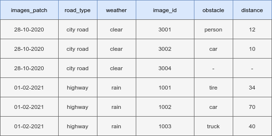
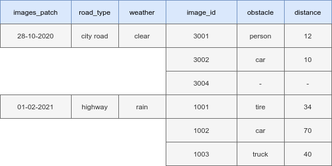
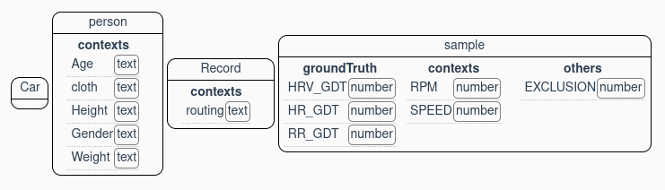

# How DebiAI block structure works

How does the DebiAI Python module block structure works, what is it and why does it matters.

- [How DebiAI block structure works](#how-debiai-block-structure-works)
  - [Introduction](#introduction)
  - [Columns categories](#columns-categories)
  - [Block levels](#block-levels)


## Introduction

The block structure is piece of configuration that can be given to DebiAI after the creation of a project.

To display a project data, DebiAI needs to know :
- which one of the columns it needs to load when uploading samples from a dataframe or a numpy array
- what are the category of those columns [(Columns categories)](#columns-categories)
- which columns are the primary key of the database and reduce redundancy [(Block levels)](#block-levels)

## Columns categories

DebiAI support those column categories :
- inputs
- groundTruth
- contexts
- others

The categories of each column are mainly used in the analysis dashboard to help the user select the right column :


<!-- The "groundTruth" and "inputs" columns are also used to generate a tensorflow dataset, see [
Training on a dataset directly from a DebiAI selection or project](https://git.irt-systemx.fr/ML/DebiAI/pythonModule#training-on-a-dataset-directly-from-a-debiai-selection-or-project). -->

Those categories will later be used by DebiAI to make analysis suggestions.

## Block levels

We are working on an obstacle detection project, and we want to add a dataset to DebiAI that looks like this:



In our project, the images are grouped by patch.

We can simply define a block structure like this one:
```Python
block_structure = [
  { # Block n°1: Images
    "name": "image_id",
    "contexts": [
        {"name": 'images_patch', "type": "text"},
        {"name": 'road_type',    "type": "text"},
        {"name": 'weather',      "type": "text"},
      ],
    "groundTruth":[
        {"name": 'obstacle',     "type": "text"},
        {"name": 'distance',     "type": "number"},
    ]
  }
]
```

This block structure will work just fine, however, if some images from different patches have the same ID, they will replace each other.
Also, there will be a lot of redundency in the image patch properties :


But with with a block structure like this one, we can remove the redundency:

```Python
block_structure = [
  { # Block n°1: Images patch
    "name": "images_patch",
    "contexts": [
        {"name": 'road_type',    "type": "text"},
        {"name": 'weather',      "type": "text"},
      ],
  },
  { # Block n°2: Images
    "name": "image_id",
    "groundTruth":[
        {"name": 'obstacle',     "type": "text"},
        {"name": 'distance',     "type": "number"},
    ]
  }
]
```

This block structure will also help DebiAI reduce redundencies when storing the data:



This block structure will also make the ID of each images a double ID and we will need to precise the patch of each image patch when adding model results for example. So this solves the case were some images from different pages have the same ID.

---

We can create as many block levels as we want, the The biometric parameters detection project, for example has 4 levels of blocks:


```Python
# An example of DebiAI block structure used for a regression AI use case about detecting the driver biometric parameters :

# block structure
block_structure = [
    { # Block n°1 : Car
        "name": "Car", # Block ID
    },
    { # Block n°2 : Person
        "name": "person", # Block ID
        "contexts": [     # Block contexts
            {"name": "Age",    "type": "text"},
            {"name": "cloth",  "type": "text"},
            {"name": "Height", "type": "text"},
            {"name": "Gender", "type": "text"},
            {"name": "Weight", "type": "text"}
        ],
    },
    { # Block n°3 : Record
        "name": "Record", # Block ID
        "contexts": [     # Block contexts
            {"name": "routing", "type": "text"}
        ],
    },
    { # Block n°4 (sample) : a second of recording
        "name": "sample", # Block ID
        "others": [       # Block other columns
            {"name": "EXCLUSION", "type": "number"}
        ],
        "groundTruth": [  # Block ground truth
            {"name": "HRV_GDT", "type": "number"},
            {"name": "HR_GDT",  "type": "number"},
            {"name": "RR_GDT",  "type": "number"}
        ],
        "contexts": [     # Block contexts
            {"name": "RPM",   "type": "number"},
            {"name": "SPEED", "type": "number"}
        ]
    }
]
```


