# DebiAI Exploration mode

## Introduction

DebiAI's Exploration Mode is designed to efficiently analyze massive datasets by condensing project data into lightweight representations and leveraging server-side computations. This approach overcomes the limitations of traditional client-side analysis, enabling users to explore and extract insights from projects with millions of samples.

## Analysis mode limitations

- **All metadata are loaded client-side**
- **Metadata are analyzed by displaying plots on widgets**

### Key Issues

- **Slow download:**  
  Loading a project with 100 million samples can take ~3h30.
- **High RAM usage:**  
  Such a project can occupy more than 20GB of RAM.
- **Widget limitations:**  
  Most widgets fail or become very slow with more than 1 million samples.

**Conclusion:**  
It is not feasible to load and analyze massive datasets using the current client-side approach.

## Main Concepts

How the exploration mode addresses these limitations:

- Project data are **condensed** into lightweight representations.
- **Server-side computation** handles heavy processing.
- Client-side configuration and **lightweight analysis** of large datasets.

## Accessing Exploration Mode

The exploration mode is accessible from the project dashboard:
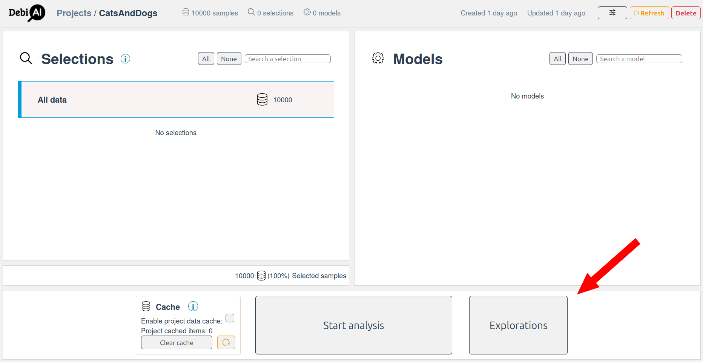
Create a new exploration and open the exploration configuration page.

## Example

Let's consider a project with 100 million images of cats and dogs, each with metadata such as class, age, luminosity, and prediction success. The goal is to analyze this data without loading all samples into the client.

### Data Structure Example

| Column               | Type            | Unique Values   | Example Values    |
| -------------------- | --------------- | --------------- | ----------------- |
| `class`              | Groundtruth     | 2               | cat, dog          |
| `age`                | Context         | 16 (0 to 15)    | 0, 1, 2, ... 15   |
| `luminosity`         | Feature (float) | 1M (0.0 to 1.0) | 0.123, 0.456, ... |
| `prediction_success` | Result          | 2               | 0, 1              |

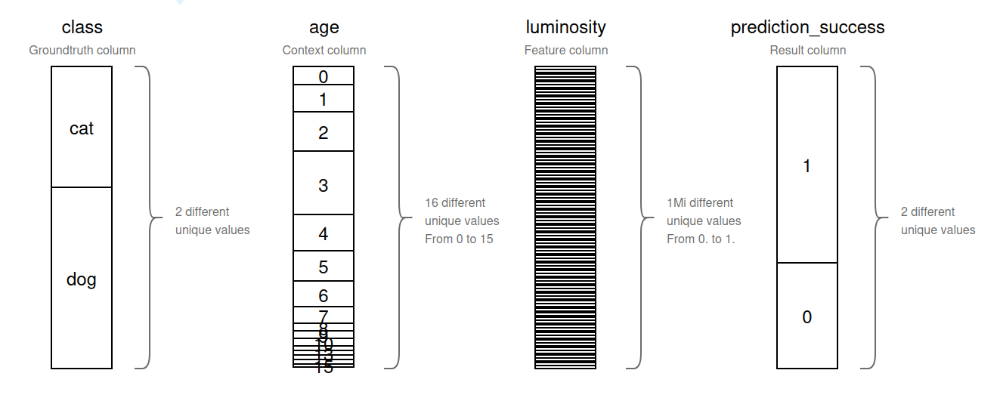

### Analysis goals

We will try to answer the following questions using the exploration mode:

- **Bias study:**
  - What is the image distribution between cats and dogs?
  - Are all ages represented for both of the classes?
- **Outliers study:**
  - Are there photos of cats that have a luminosity score < 0.1
- **Performance study:**
  - What success rate for each class, age and luminosity?

### Question 1: What is the image distribution between cats and dogs?

1. **Select the `class` column.**

In the exploration configuration, select the `class` column to analyze the distribution of images:

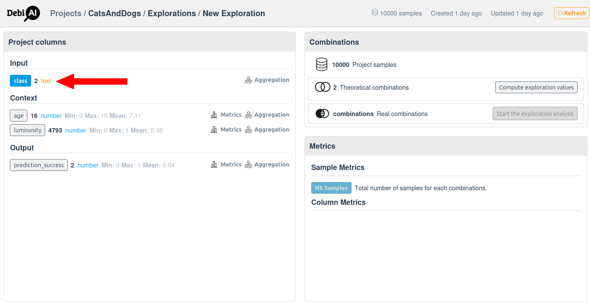

2. **Start the segmentation computation.**

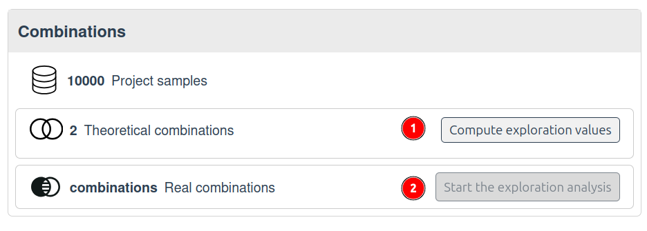

Start the segmentation computation to group the data by unique values (1)

A server-side computation groups the data by unique values in the selected column and provides metrics such as the number of samples in each group.

| class | Nb Samples |
| ----- | ---------- |
| cat   | 28,570,000 |
| dog   | 71,430,000 |

Analyze the results in the dashboard (2):

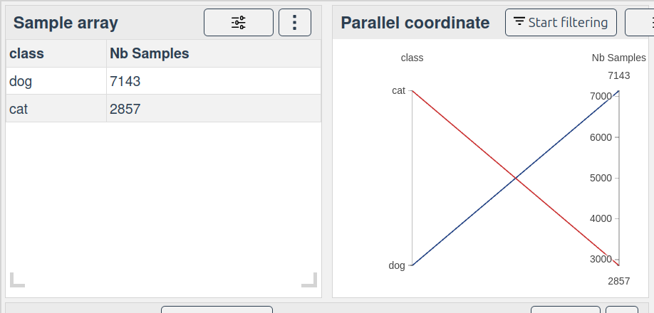
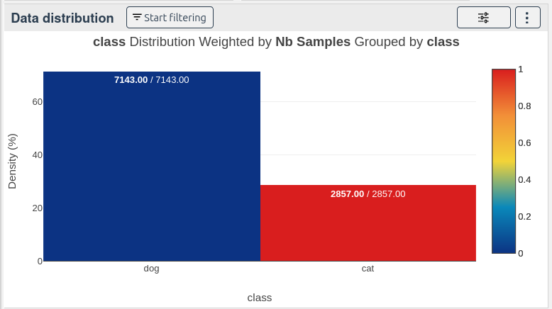

**Result:**  
28% cats and 71% dogs.

### Question 2: Are All Ages Represented for Both Classes?

1. **Select the `class` and `age` columns.**

Because `age` contains 16 unique values, and `class` contains 2 unique values, the theoretical number of combinations is 32 (2 classes \* 16 ages):
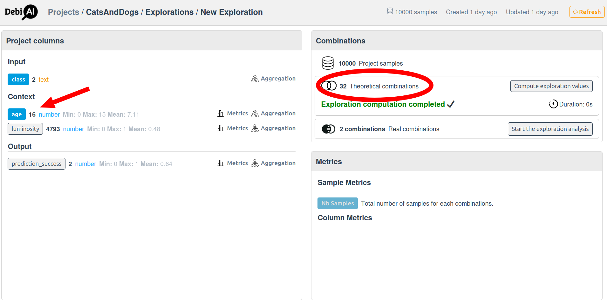

2. **Start the computation.**

The server computes all possible combinations and their metrics.

| class | age | Nb Samples |
| ----- | --- | ---------- |
| cat   | 0   | 1.3M       |
| dog   | 0   | 2.2M       |
| cat   | 1   | 2.6M       |
| dog   | 1   | 4.5M       |
| ...   | ... | ...        |

**Result:**  
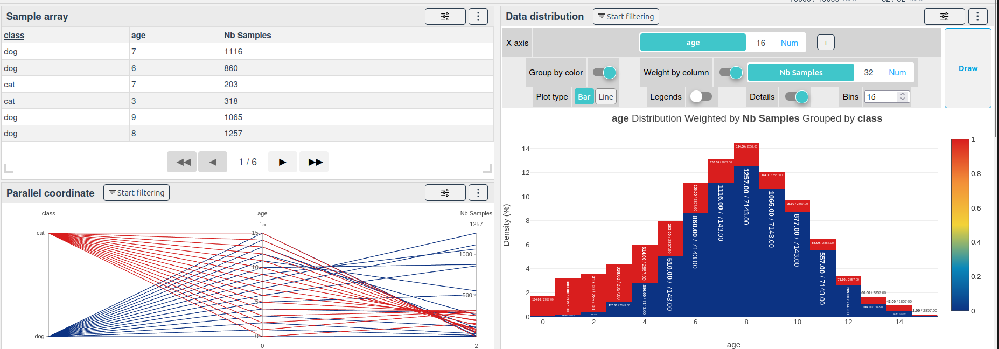
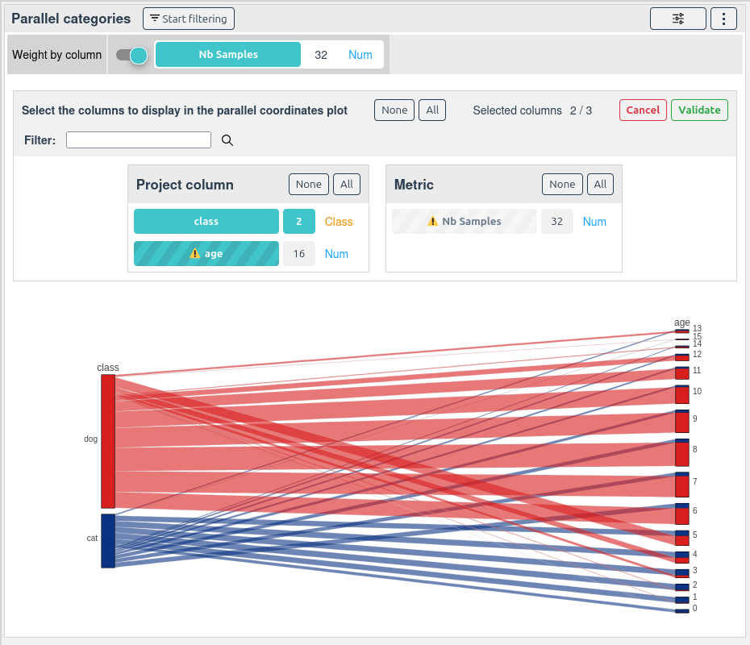
There is very few samples for ages 15 in the cat class, and very few samples for ages 0 in the dog class.

### Question 3: Are There Photos of Cats with Luminosity < 0.1?

1. **Select the `class` and `luminosity` columns.**
2. **Aggregation:**  
   Since `luminosity` is a float with 1M unique values, values are grouped into 10 bins (aggregation):

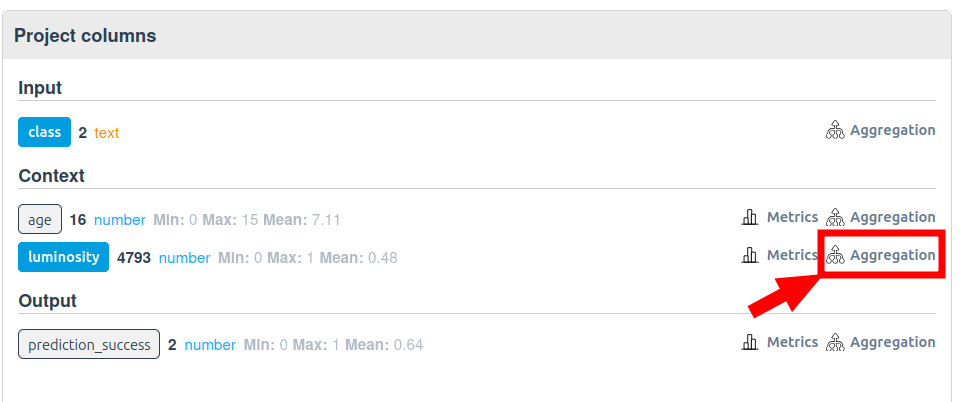
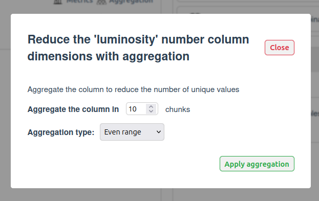

**Result:**  
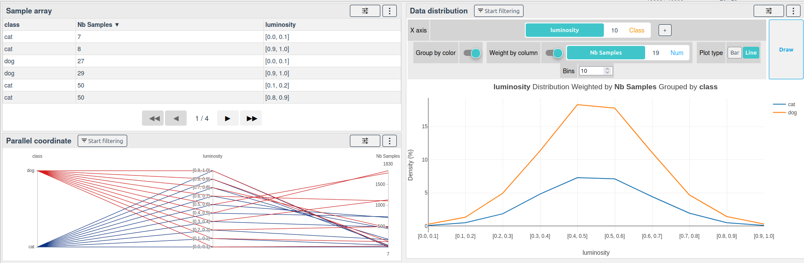

There are few samples in the extreme luminosity bins:

| class | luminosity | Nb Samples |
| ----- | ---------- | ---------- |
| cat   | [0.0, 0.1] | 7          |
| cat   | [0.9, 1.0] | 8          |
| dog   | [0.0, 0.1] | 27         |
| dog   | [0.9, 1.0] | 29         |
| ...   | ...        | ...        |

### Question 4: What Success Rate for Each Class, Age, and Luminosity?

1. **Select the `class`, `age`, and aggregated `luminosity` columns.**
2. **Add a 'mean' metric on the `prediction_success` column.**

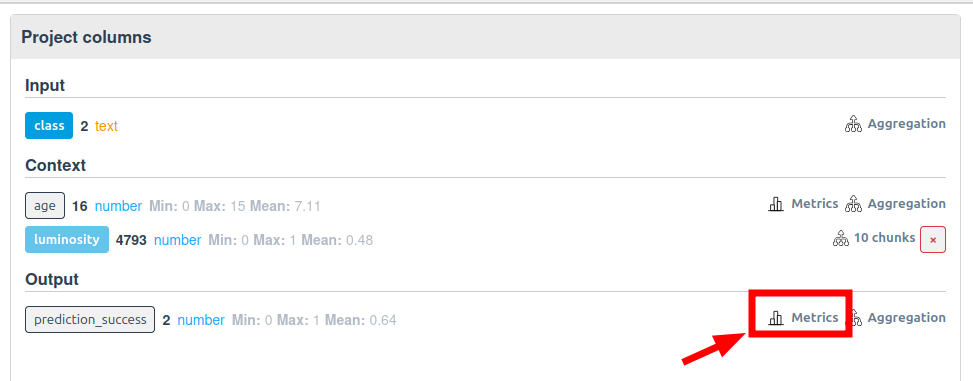

The server will compute the mean of `prediction_success` for each combination of `class`, `age`, and aggregated `luminosity`.

**Result:**
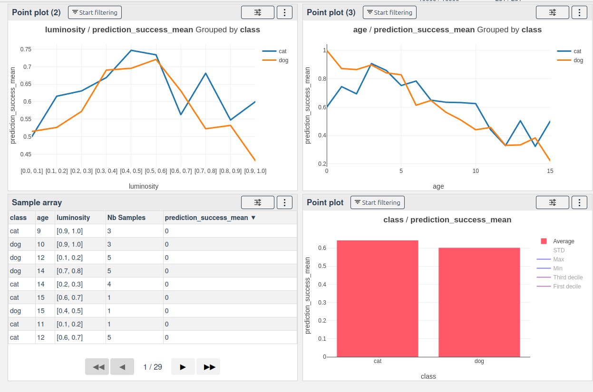

We can see that the success rate is highly dependent on the age and luminosity of the images, with a notable drop in success rate.

## Creating a selection from selected combinations

Once the analysis is complete, you can create a selection from the computed combinations. Select the some combinations and click on the "Create selection" button:
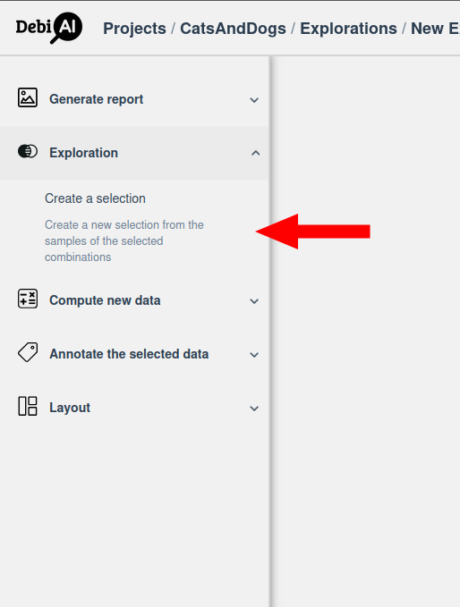
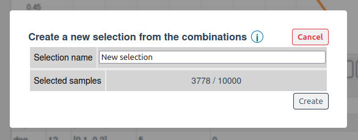

This will create a new selection in the project containing only the samples that match the selected combinations. This allows you to focus on specific subsets of your data for further analysis or model training.

## How It Works

1. **Combination Computation:**  
   Server computes all possible combinations of selected columns and their metrics.
2. **Aggregation:**  
   For columns with too many unique values (e.g., floats, texts), values are grouped into bins.
3. **Metrics:**  
   Additional metrics (e.g., mean) can be computed on the resulting combinations.

## Conclusion

DebiAI Exploration Mode enables scalable, efficient analysis of massive datasets by offloading heavy computations to the server and providing lightweight, aggregated results to the client. This approach allows users to answer complex questions about their data without the limitations of traditional client-side analysis.
